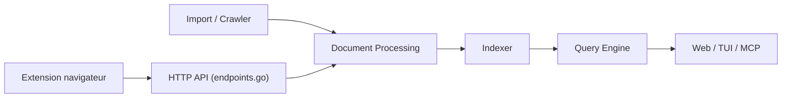

# asciimoo/hister

> Moteur de recherche personnel qui indexe le contenu des pages visitées et des fichiers locaux.

## Le problème
Retrouver une page déjà lue ou un fichier gardé, quand seuls titres et URL sont cherchables dans l'historique du navigateur.

## Ce que ça fait vraiment
Un serveur Go (`hister listen`) indexe le texte complet des pages envoyées par une extension Firefox/Chrome, ainsi que des imports (historique, favoris, dossiers) et un crawler. La recherche se fait par le web, un TUI, la ligne de commande ou un serveur MCP. Une recherche sémantique optionnelle passe par un endpoint d'embeddings que tu configures. Mode multi-utilisateur avec OAuth.

## Comment c'est branché


## Essayer
```bash
chmod +x hister
./hister listen
# puis ouvrir l'interface web et installer l'extension Firefox ou Chrome
```

## Coût et pièges
Gratuit, sans télémétrie ni cloud obligatoire. Attention : la recherche sémantique envoie le texte des documents à l'endpoint d'embeddings choisi. Le serveur doit rester lancé pour indexer.

## Ce que ce n'est pas
Pas un moteur du web : il n'indexe que ce que tu visites ou importes. Licence AGPL-3.0.

## Alternatives
Aucune alternative nommée dans le README.

## Pour toi
À surveiller : pratique comme mémoire de recherche locale, avec un serveur MCP pour l'exposer à un assistant ; l'AGPL n'est gênante que si tu comptes le redistribuer.
