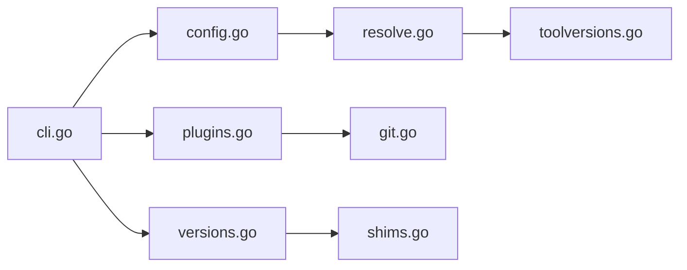

# asdf-vm/asdf

> Gestionnaire unique de versions de runtimes par projet, extensible par plugins, pour développeurs multi-langages.

## Le problème
Un gestionnaire de versions par langage (nvm, pyenv, rbenv…) avec ses commandes propres.

## Ce que ça fait vraiment
Une CLI avec des plugins par langage. Un fichier `.tool-versions` par projet fixe les versions, les fichiers existants (`.nvmrc`, `.node-version`, `.ruby-version`) sont lus, et les exécutables passent par des shims. Les versions changent à mesure qu'on parcourt les dossiers. Complétion pour Bash, Zsh, Fish, Elvish.

## Comment c'est branché

## Essayer
Aucune commande documentée dans ce README : il renvoie à la documentation d'asdf pour démarrer.

## Coût et pièges
Gratuit. Le support d'un langage dépend de la qualité de son plugin, maintenu à part.

## Ce que ce n'est pas
Pas un gestionnaire de paquets ni d'environnements virtuels : il gère des versions de runtimes. Le README ne détaille pas ici l'installation.

## Alternatives
- gvm, nvm, rbenv, pyenv : spécialisés par langage, ce que asdf cherche à unifier.

## Pour toi
Adopter si tu jongles entre versions de Python, Node et outils MLOps : un seul fichier par projet rend l'environnement reproductible.

