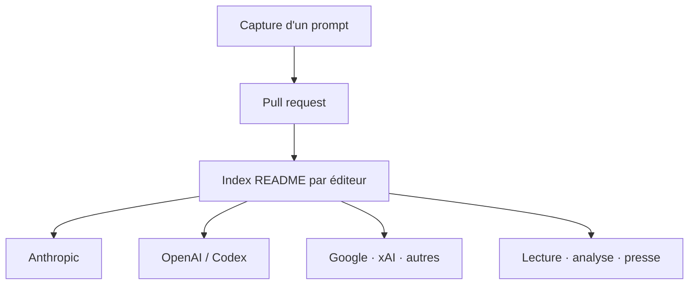

# asgeirtj/system_prompts_leaks

> Collection des prompts système verbatim des principaux chatbots et agents de code.

## Le problème
Les prompts système des produits LLM ne sont pas publiés. Comprendre leurs contraintes réelles suppose de les capturer un à un.

## Ce que ça fait vraiment
Un index de fichiers, organisé par éditeur : Anthropic (Claude.ai, Claude Code, Projects, Cowork, Science, Design, intégrations M365, Chrome, iOS), OpenAI (ChatGPT, Codex, prompts injectés par l'API), Google (Gemini, Antigravity, NotebookLM), xAI, Perplexity, Microsoft, Meta, Mistral, Moonshot, DeepSeek, Qwen, plus une trentaine de produits divers. Un tableau « Most recent additions » date chaque ajout. Contributions par PR.

## Comment c'est branché

## Essayer
Aucune commande documentée : le dépôt se lit, il ne s'installe pas.

## Coût et pièges
Gratuit. Aucune licence n'est déclarée dans le README — point à vérifier avant tout réemploi. Le contenu est par nature non officiel et daté.

## Ce que ce n'est pas
Ce n'est pas une source officielle ni vérifiée par les éditeurs : ce sont des captures, potentiellement partielles ou périmées dès la version suivante. Ce n'est pas un outil, et rien n'y est exécutable.

## Alternatives
Aucune alternative nommée dans le README.

## Pour toi
À surveiller : matière de lecture précieuse pour écrire tes propres prompts d'agents, à condition de traiter chaque fichier comme une capture datée.
