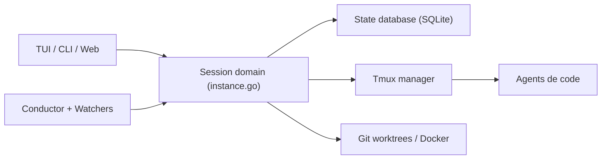

# asheshgoplani/agent-deck

> Console terminal pour superviser, forker et orchestrer plusieurs sessions d'agents de code via tmux.

## Le problème
Avec plusieurs agents (Claude Code, OpenCode, Codex…) sur plusieurs projets, on ne sait plus qui tourne, attend ou a échoué.

## Ce que ça fait vraiment
Binaire Go avec TUI Bubble Tea, sessions dans tmux, statuts en direct, groupes, recherche, fork de sessions avec contexte, worktrees Git, sandbox Docker, gestion MCP/skills, suivi des coûts et quotas, instances distantes en SSH, interface web locale. Les « conductors » sont des agents superviseurs pilotables par Telegram ou Slack, avec des watchers (GitHub, ntfy, webhook).

## Comment c'est branché


## Essayer
```bash
curl -fsSL https://raw.githubusercontent.com/asheshgoplani/agent-deck/main/install.sh | bash
agent-deck
agent-deck add . -c claude
agent-deck web
```

## Coût et pièges
Gratuit ; les agents pilotés restent à ta charge. 126 issues ouvertes et README très long. Le mode web hors loopback exige un jeton. La télémétrie est désactivée par défaut (opt-in).

## Ce que ce n'est pas
Pas un agent lui-même : un gestionnaire de sessions. Windows via WSL seulement.

## Alternatives
Le README compare seulement à tmux brut, dont il est une couche.

## Pour toi
À surveiller : utile si tu lances plusieurs agents de code en parallèle, mais mainteneur unique et surface fonctionnelle très large.
