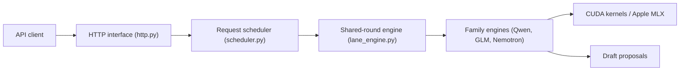

# ashhart/TensorFold

> Serveur d'inférence à API compatible OpenAI pour Apple Silicon et GPU NVIDIA, avec décodage spéculatif exact.

## Le problème
Servir de gros modèles quantifiés en local demande des noyaux adaptés par famille de modèles et une reprise de prompt efficace.

## Ce que ça fait vraiment
Chaque famille (Qwen3.8, Nemotron 3.5, GLM-5.3-Flash, Gemma 4, DeepSeek-V4-Flash…) apporte ses noyaux MLX ou CUDA et son vérificateur de brouillons. Un brouillon n'est accepté que s'il égale le jeton qu'aurait produit le même moteur en série. Le serveur gère le cache de préfixes (avec snapshots disque sur MLX), plusieurs requêtes concurrentes, l'image en entrée (option `--vision`) et deux rangs CUDA.

## Comment c'est branché


## Essayer
```bash
python -m pip install git+https://github.com/ashhart/TensorFold.git
tensorfold serve Vontra/NVIDIA-Nemotron-3.5-Lightning-30B-A3B-MLX-4bit
tensorfold pull Vontra/Qwen3.8-27B-MLX-4bit z-lab/Qwen3.8-27B-DFlash2
tensorfold update --check
```

## Coût et pièges
Python 3.11+, MLX 0.32.2+ sur Mac ; conteneur PyTorch NVIDIA pour CUDA. Mac de 64 Go ou plus pour les gros modèles ; la table de mémoire est presque partout à `TBD`. Vérification de version au démarrage (`--no-update-check`). Un point de contrôle de brouillon GLM a une licence non commerciale.

## Ce que ce n'est pas
Pas un serveur avec performances chiffrées dans le README : les mesures sont renvoyées aux notes de version. L'exactitude vaut pour un même moteur, pas entre MLX et CUDA.

## Alternatives
Aucune alternative citée ; le README compare aux « serveurs standard » sans les nommer.

## Pour toi
À surveiller : approche rigoureuse du décodage spéculatif exact, mais projet jeune, tenu par une personne, avec qualification matérielle encore incomplète.
