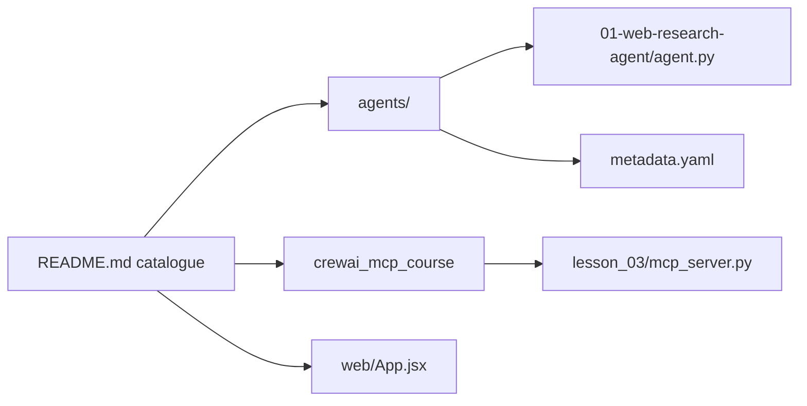

# ashishpatel26/500-AI-Agents-Projects

> Catalogue de cas d'usage d'agents IA par secteur et framework, avec quelques exemples exécutables.

## Le problème
Se repérer entre frameworks d'agents et trouver des exemples concrets par secteur prend du temps.

## Ce que ça fait vraiment
Surtout des tableaux de liens vers des projets externes (santé, finance, cybersécurité…) et des notebooks CrewAI, AutoGen, Agno, LangGraph. Le dossier `agents/` contient 21 agents Python autonomes (chacun son `requirements.txt` et `.env.example`), plus un cours CrewAI + MCP et un site catalogue React.

## Comment c'est branché


## Essayer
```bash
git clone https://github.com/ashishpatel26/500-AI-Agents-Projects.git
cd agents/01-web-research-agent
pip install -r requirements.txt
cp .env.example .env
python agent.py
```

## Coût et pièges
Clé d'API LLM à fournir par exemple. Le chiffre « 500+ » compte surtout des liens externes, non vérifiés.

## Ce que ce n'est pas
Pas un framework ni un runtime commun ; la qualité des projets liés est inégale.

## Alternatives
Le README compare LangGraph, CrewAI, AutoGen, Agno, LlamaIndex comme frameworks, pas comme alternatives à la liste.

## Pour toi
Bon point d'entrée pour trouver un exemple de pattern ; ne pas s'y fier comme référence qualité.
