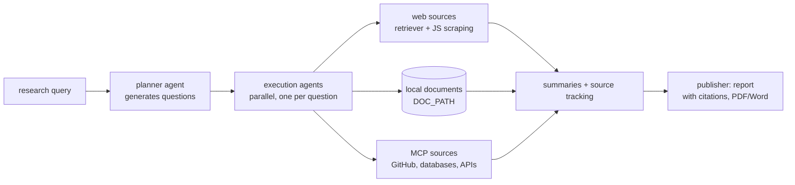

# assafelovic/gpt-researcher

> **An agent that breaks a question down, reads the web and your own documents, and returns a report with citations.**

## The problem

Ask an LLM an open question and you get an answer you cannot check, dated by its training cut-off
and with no sources. Gathering twenty sources yourself, reading them, summarising them and tying
every claim back to where it came from costs hours per topic — and a model's context limit will not
let you emit a long report in a single call anyway.

## What it actually does

The core, as the README describes it: a **planner** agent turns the query into research questions,
**execution** agents fetch information for each question in parallel, and a **publisher** aggregates
the findings.

- Every resource is summarised **and its source tracked**, before filtering and aggregation.
- Web scraping runs JavaScript; images found on pages are scraped and filtered.
- Numbers the README states: over 20 sources aggregated, reports beyond 2,000 words, export to PDF,
  Word and other formats.
- Research over local documents via `DOC_PATH`: PDF, plain text, CSV, Excel, Markdown, PowerPoint
  and Word.
- MCP servers can be used **as inputs** (GitHub repositories, databases, custom APIs) with
  `RETRIEVER=tavily,mcp`, alongside web search.
- Two extras: a recursive "Deep Research" mode exploring a tree with configurable depth and breadth,
  and inline image generation through Gemini, off unless enabled.

What it does not do itself: the model, the search engine, the storage. It orchestrates them.

## How it is wired

No code-derived diagram exists for this repository; the graph below is reconstructed from the
*Architecture* section of the README.



## Try it

```bash
git clone https://github.com/assafelovic/gpt-researcher.git
cd gpt-researcher
export OPENAI_API_KEY={Your OpenAI API Key here}
export TAVILY_API_KEY={Your Tavily API Key here}
pip install -r requirements.txt
python -m uvicorn main:app --reload
```

Then open `http://localhost:8000`. Other paths the README gives: `pip install gpt-researcher` for
the library, `docker-compose up --build` (Python server on 8000, React app on 3000),
`export DOC_PATH="./my-docs"` for local documents, and `npx skills add assafelovic/gpt-researcher`
to install it as a Claude Skill.

## Cost and traps

- **Python 3.11 or later** (README, step 1).
- **Two API keys at minimum** on the default path: `OPENAI_API_KEY` for the model and
  `TAVILY_API_KEY` for search. Both are billed by third parties; the repository hosts nothing.
  `OPENAI_BASE_URL` lets you point at a local model or another compatible provider, but the search
  side stays a third-party service.
- **The only cost figure in the README** covers Deep Research: roughly 5 minutes and about $0.4 per
  research run using `o3-mini` at "high" reasoning effort. For an ordinary report no figure is given:
  the bill tracks the number of sources and the model you pick.
- Each option adds an account: `GOOGLE_API_KEY` for images, `LANGCHAIN_API_KEY` for LangSmith
  tracing, `OKAHU_API_KEY` for Monocle's Okahu exporter. Monocle tracing is an opt-in extra, off by
  default.

## What it is not

- **Not an MCP server**, contrary to what the catalogue assumed: the MCP server moved to a dedicated
  repository, `assafelovic/gptr-mcp`. Here MCP plays the opposite role — a data source to query.
- **Not a guarantee of neutrality.** The README states the assumption plainly: scraping more sites
  *reduces* the chance of wrong facts, it does not remove it, and the project does not claim to
  eliminate bias. The disclaimer calls it an experimental application provided as-is, and not
  academic advice.
- **Not a search engine and not a model**, and not instant: the README counts in minutes, not
  seconds.

## Alternatives

| | When to prefer it |
|---|---|
| **assafelovic/gptr-mcp** (named in the README) | When you only want an assistant to trigger deep research over MCP, without running the server or the frontend. |
| **The `multi_agents/` folder of this same repository** (LangGraph, `ag2ai/ag2`) | When you want a team of specialised agents through to publication rather than the base planner/executor loop. |

Among the catalogue's computed neighbours (D4Vinci/Scrapling, MODSetter/SurfSense,
firecrawl/firecrawl-mcp-server, dagucloud/dagu), none is comparable as things stand: none is named
in this README, and nothing on disk supports the claim that they cover the same ground.

## For you

Worth adopting as a **sourced-report building block** rather than as a finished product: the pip
library is three lines (`conduct_research()` then `write_report()`), drops into a pipeline, and its
source tracking is precisely what a hand-rolled RAG lacks. The thing to watch is the bill: at $0.4
per deep research run, looped usage needs monitoring.
