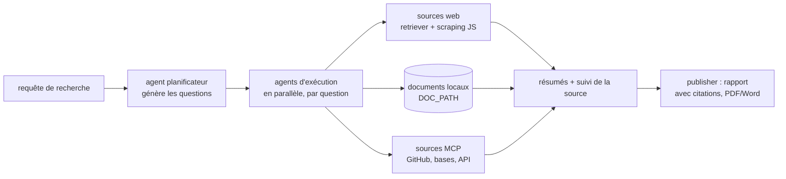

# assafelovic/gpt-researcher

> **Un agent qui décompose une question, va lire le web et tes documents, et rend un rapport sourcé.**

## Le problème

Poser une question ouverte à un LLM donne une réponse invérifiable, datée par son
entraînement, sans sources. Réunir soi-même vingt sources, les lire, les résumer et rattacher
chaque affirmation à son origine prend des heures par sujet — et la limite de contexte d'un
modèle ne permet de toute façon pas de sortir un rapport long en un seul appel.

## Ce que ça fait vraiment

Le cœur, tel que le README le décrit : un agent **planificateur** qui transforme la requête
en questions de recherche, des agents **d'exécution** qui vont chercher l'information pour
chaque question en parallèle, puis un **publisher** qui agrège.

- Chaque ressource est résumée **et sa source conservée**, avant filtrage et agrégation.
- Le scraping web exécute le JavaScript ; les images des pages sont récupérées et filtrées.
- Chiffres annoncés par le README : plus de 20 sources agrégées, rapports de plus de 2 000 mots,
  export PDF / Word et autres formats.
- Recherche sur documents locaux via `DOC_PATH` : PDF, texte brut, CSV, Excel, Markdown,
  PowerPoint, Word.
- Sources MCP utilisables **en entrée** (dépôts GitHub, bases, API maison) avec
  `RETRIEVER=tavily,mcp`, en complément de la recherche web.
- Deux extras : un mode « Deep Research » récursif en arbre (profondeur et largeur réglables),
  et la génération d'images inline via Gemini, désactivée par défaut.

Ce qu'il ne fait pas lui-même : le modèle, le moteur de recherche, le stockage. Il orchestre.

## Comment c'est branché

Aucun diagramme tiré du code n'est disponible pour ce dépôt ; le schéma ci-dessous est
reconstitué à partir de la section *Architecture* du README.



## Essayer

```bash
git clone https://github.com/assafelovic/gpt-researcher.git
cd gpt-researcher
export OPENAI_API_KEY={Your OpenAI API Key here}
export TAVILY_API_KEY={Your Tavily API Key here}
pip install -r requirements.txt
python -m uvicorn main:app --reload
```

Puis `http://localhost:8000`. Autres chemins donnés par le README : `pip install gpt-researcher`
pour la bibliothèque, `docker-compose up --build` (serveur sur 8000, frontend React sur 3000),
`export DOC_PATH="./my-docs"` pour les documents locaux, et `npx skills add assafelovic/gpt-researcher`
pour l'installer comme skill Claude.

## Coût et pièges

- **Python 3.11 ou plus** (README, étape 1).
- **Deux clés d'API au minimum** dans le chemin par défaut : `OPENAI_API_KEY` pour le modèle et
  `TAVILY_API_KEY` pour la recherche. Les deux sont facturées chez des tiers, le dépôt n'héberge
  rien. `OPENAI_BASE_URL` permet de viser un modèle local ou un autre fournisseur compatible,
  mais la brique recherche reste un service tiers.
- **Le seul coût chiffré du README** porte sur Deep Research : environ 5 minutes et ~0,4 $ par
  recherche avec `o3-mini` en effort de raisonnement « high ». Pour un rapport ordinaire, aucun
  chiffre n'est donné : la facture suit le nombre de sources et le modèle choisi.
- Chaque option ajoute un compte : `GOOGLE_API_KEY` pour les images, `LANGCHAIN_API_KEY` pour le
  traçage LangSmith, `OKAHU_API_KEY` pour l'exporteur Okahu de Monocle. Le traçage Monocle est un
  extra opt-in, éteint par défaut.

## Ce que ce n'est pas

- **Pas un serveur MCP**, contrairement à ce que supposait le catalogue : le serveur MCP a été
  déplacé dans un dépôt dédié, `assafelovic/gptr-mcp`. Ici, MCP joue le rôle inverse — une source
  de données à interroger.
- **Pas une garantie de neutralité.** Le README pose l'hypothèse explicitement : multiplier les
  sites *réduit* le risque d'information fausse, il ne l'annule pas, et le projet ne prétend pas
  éliminer les biais. Le disclaimer le qualifie d'application expérimentale fournie en l'état,
  sans valeur de conseil académique.
- **Pas un moteur de recherche ni un modèle**, et pas instantané : le README compte en minutes,
  pas en secondes.

## Alternatives

| | Quand le préférer |
|---|---|
| **assafelovic/gptr-mcp** (cité par le README) | Si tu veux seulement qu'un assistant déclenche une recherche profonde via MCP, sans faire tourner le serveur ni le frontend. |
| **Le dossier `multi_agents/` du même dépôt** (LangGraph, `ag2ai/ag2`) | Si tu veux une équipe d'agents spécialisés jusqu'à la publication plutôt que la boucle planificateur/exécuteur de base. |

Parmi les voisins calculés du catalogue (D4Vinci/Scrapling, MODSetter/SurfSense,
firecrawl/firecrawl-mcp-server, dagucloud/dagu), aucun n'est comparable en l'état : aucun n'est
cité par ce README, et rien sur le disque ne permet d'affirmer qu'ils couvrent le même périmètre.

## Pour toi

À adopter comme **brique de rapport sourcé** plutôt que comme produit fini : la bibliothèque pip
s'appelle en trois lignes (`conduct_research()` puis `write_report()`), s'enchaîne dans un
pipeline, et le suivi des sources est exactement ce qui manque à un RAG maison. Le point de
vigilance est la facture : à 0,4 $ la recherche profonde, un usage en boucle se surveille.
