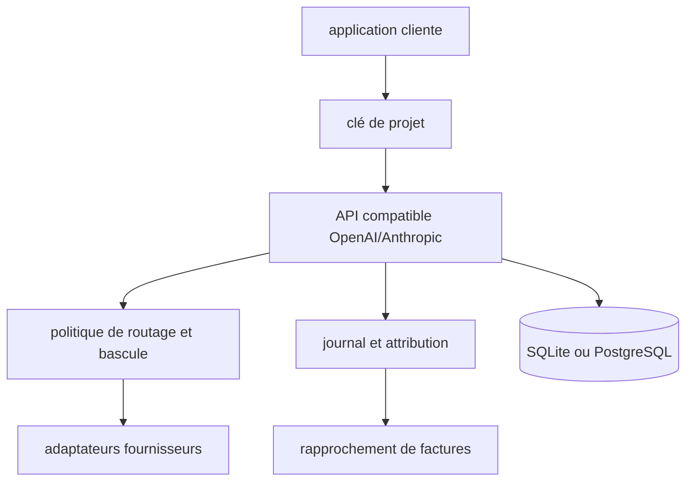

# astaxie/TokenHub

> Passerelle de gouvernance qui place routage, quotas et attribution de coûts devant chaque appel de modèle.

## Le problème
Dès que plusieurs équipes consomment des modèles, les clés fournisseur se recopient dans chaque application.
Personne ne sait ensuite rattacher une facture à un projet, ni changer de modèle sans modifier le code client.

## Ce que ça fait vraiment
Distribue des clés portées par projet et par équipe, avec quotas, permissions de membres et limites de concurrence.
Le routage de modèles est une politique administrable : priorité, poids, ordre de bascule, choix par scénario, diagnostic de santé des routes.
Journalise chaque requête en l'attribuant à un utilisateur, un projet, une équipe, un modèle et un centre de coût, puis compare l'usage interne aux factures fournisseur.
Expose des API compatibles OpenAI (`/v1/chat/completions`, `/v1/responses`, `/v1/embeddings`) et Anthropic (`/v1/messages`, `/v1/messages/count_tokens`), plus génération et édition d'images.

## Comment c'est branché


## Essayer
```bash
curl -fsSL https://raw.githubusercontent.com/astaxie/TokenHub/main/deploy/native/install.sh \
  -o /tmp/tokenhub-install.sh
sudo bash /tmp/tokenhub-install.sh install
cp deploy/.env.example deploy/.env
./deploy/install.sh
```

## Coût et pièges
Chaque valeur `change-me` de `deploy/.env` doit être remplacée par un secret fort avant démarrage.
Le mot de passe admin initial est imprimé une seule fois par l'installeur natif, ou vaut `TOKENHUB_BOOTSTRAP_ADMIN_PASSWORD` en Docker.
Les clés des fournisseurs amont restent à ta charge ; SQLite par défaut, PostgreSQL requis pour du multi-instance.

## Ce que ce n'est pas
Pas une passerelle de plus qui se contente de rediriger vers plusieurs fournisseurs : le README pose explicitement la gouvernance comme la différence.
Pas un service géré : tout est auto-hébergé, y compris la sauvegarde et les montées de version.
Les 150+ modèles de fournisseurs ne sont pas tous natifs — sans adaptateur dédié, la connexion se fait en compatible OpenAI, avec les limites que cela implique.

## Alternatives
Aucune alternative nommée dans le README.

## Pour toi
À regarder le jour où plusieurs projets tirent sur les mêmes clés d'API et que la facture cesse d'être explicable.
