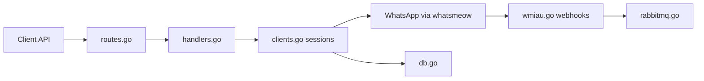

# asternic/wuzapi

> API REST en Go, multi-comptes, qui pilote WhatsApp via la bibliothèque whatsmeow.

## Le problème
Automatiser l'envoi et la réception de messages WhatsApp sans émulateur Android ni Chrome headless.

## Ce que ça fait vraiment
Serveur HTTP qui gère plusieurs sessions WhatsApp (QR code) et expose des endpoints : session, messages (texte, médias, sondages), utilisateurs, groupes, présence. Les événements sortent par webhooks signés HMAC ou RabbitMQ ; stockage SQLite ou PostgreSQL, médias en S3 en option. Tableau de bord intégré.

## Comment c'est branché


## Essayer
```bash
cp .env.sample .env
go build .
./wuzapi -logtype=console -color=true
brew install asternic/wuzapi/wuzapi
```

## Coût et pièges
Violer les conditions de WhatsApp peut faire bannir le numéro. Si les clés d'admin et de chiffrement sont auto-générées, il faut les sauvegarder. Un changement de protocole WhatsApp peut casser la connexion.

## Ce que ce n'est pas
Pas l'API officielle WhatsApp Business ; non affilié à WhatsApp.

## Alternatives
L'API WhatsApp Business via un fournisseur officiel, recommandée par le README pour un usage commercial.

## Pour toi
À surveiller : utile pour des notifications de pipeline ou un chatbot en prototype, mais fragile et risqué en production.

