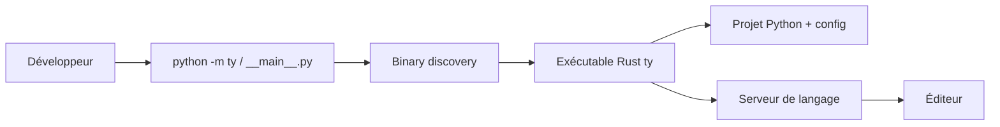

# astral-sh/ty

> Vérificateur de types Python et serveur de langage écrits en Rust, par Astral, pour développeurs Python.

## Le problème
mypy et Pyright sont lents sur les gros projets, surtout dans l'éditeur où chaque frappe relance une analyse.

## Ce que ça fait vraiment
`ty check` analyse un projet et renvoie des diagnostics avec contexte ; un mode serveur de langage fournit navigation, complétion, actions, imports automatiques et infobulles, avec analyse incrémentale fine. Il annonce 10 à 100 fois la vitesse de mypy et Pyright, gère les types d'intersection et le narrowing avancé. Le module Python `python -m ty` ne fait que retrouver et lancer le binaire Rust ; les sources Rust sont dans un sous-module non lu ici.

## Comment c'est branché


## Essayer
```bash
uvx ty check
```

## Coût et pièges
Gratuit. Versionnage 0.0.x : changements cassants possibles, y compris sur les diagnostics, entre deux versions.

## Ce que ce n'est pas
Ce n'est pas encore stable : le README dit « beta ». Ce n'est pas un formateur ni un linter.

## Alternatives
mypy et Pyright (comparaison de vitesse citée dans le README).

## Pour toi
À surveiller : très prometteur pour des bases de code ML volumineuses, mais attends la stabilité avant de l'imposer en CI.

