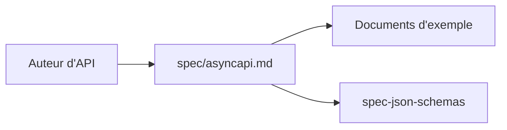

# asyncapi/spec

> Spécification AsyncAPI, le format de description des API asynchrones et pilotées par événements.

## Le problème
Les API à messages (files, flux d'événements) n'ont pas de contrat standard comparable à OpenAPI, ce qui complique documentation et génération de code.

## Ce que ça fait vraiment
Dépôt de la spécification : le fichier Markdown `spec/asyncapi.md` est la source de vérité. Il suit la dernière version (3.1.0) et garde les versions antérieures liées. Des exemples de documents se trouvent dans `examples`. Les schémas JSON sont dans un autre dépôt (spec-json-schemas).

## Comment c'est branché


## Essayer
```bash
# aucune commande dans le README : lire spec/asyncapi.md et le dossier examples
```

## Coût et pièges
Gratuit, rien à installer. La spécification n'est pas un logiciel : pour générer du code ou de la documentation il faut les outils AsyncAPI, non décrits dans ce README.

## Ce que ce n'est pas
Pas un runtime, ni un outil de génération, ni un courtier de messages : uniquement le texte de la spécification.

## Alternatives
Aucune alternative nommée dans le README.

## Pour toi
Surveiller : utile pour documenter des flux d'événements (Kafka, MQTT) de pipelines de données, sans effet tant que tu n'as pas de tels flux.

