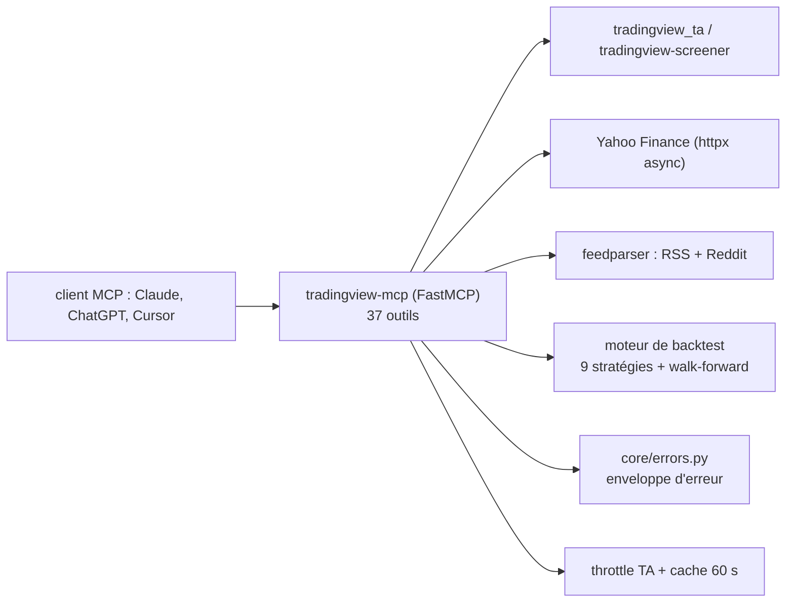

# atilaahmettaner/tradingview-mcp

> Serveur MCP de données de marché, indicateurs techniques, screeners et backtests pour assistants.

## Le problème
Demander à un assistant une analyse technique ou un backtest suppose de brancher soi-même un
fournisseur de données, une bibliothèque d'indicateurs et un moteur de backtest, chacun avec sa clé.

## Ce que ça fait vraiment
Expose 37 outils MCP : analyse technique complète (RSI, MACD, Bollinger, 23 indicateurs), analyse
multi-timeframe hebdo→15m, screeners multi-bourses, détecteur de 15 figures de chandeliers, prix
temps réel et instantané global via Yahoo Finance, sentiment Reddit et fils RSS (Yahoo, MarketWatch,
CNBC, CoinDesk, CoinTelegraph). Le moteur de backtest couvre 9 stratégies avec commission et
slippage simulés, métriques Sharpe/Calmar/Profit Factor/Expectancy, comparaison classée des 9, et
validation walk-forward rendant un verdict ROBUST/MODERATE/WEAK/OVERFITTED. Les erreurs suivent une
enveloppe structurée (`code`, `retryable`) au lieu de chaînes, ce qui distingue « aucun résultat
aujourd'hui » d'un plafond de débit amont. Sept outils chauds sont passés en `async`.

## Comment c'est branché


## Essayer
```bash
pip install tradingview-mcp-server
git clone https://github.com/atilaahmettaner/tradingview-mcp && cd tradingview-mcp && uv run tradingview-mcp
uv tool install --python 3.13 tradingview-mcp-server
uv tool install tradingview-mcp-server
```
Configuration Claude Desktop :
```json
{
  "mcpServers": {
    "tradingview": {
      "command": "uvx",
      "args": ["--python", "3.13", "--from", "tradingview-mcp-server", "tradingview-mcp"]
    }
  }
}
```

## Coût et pièges
Auto-hébergement gratuit et MIT ; la version hébergée est à 9 ou 29 $/mois avec 3 jours d'essai.
Python 3.14 n'est pas supporté : sans épingler 3.13, le premier lancement dépasse le délai MCP
(`error -32001`). Les appels parallèles peuvent heurter le plafond de débit amont, d'où le throttle.

## Ce que ce n'est pas
Pas un produit TradingView : projet indépendant, sans affiliation, qui ne se connecte pas à un
compte TradingView, ne le scrape pas et ne l'automatise pas. Pas un conseil financier : le README
consacre un avertissement entier au fait que les signaux, entrées, stops et cibles ne sont pas des
recommandations, que les données peuvent être retardées ou fausses, et que le risque de perte est
substantiel. Pas un exécuteur d'ordres.

## Alternatives
- `tradesdontlie/tradingview-mcp` : si on veut piloter TradingView Desktop (Pine Script, dessins).

## Pour toi
Bon exemple d'un serveur MCP soigné (enveloppes d'erreur, async, throttle) ; le domaine est à part.
