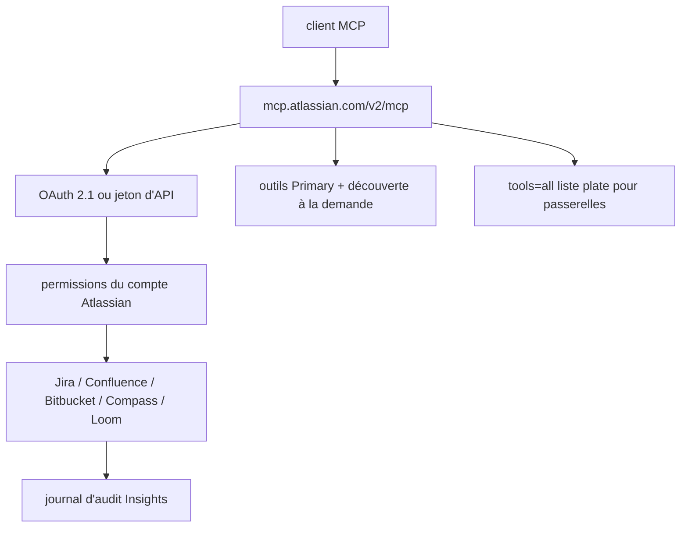

# atlassian/atlassian-mcp-server

> Serveur MCP officiel hébergé qui donne à un agent un accès permissionné à Jira, Confluence et Bitbucket.

## Le problème
Alimenter un agent avec le contexte Jira ou Confluence se fait à la main, par copier-coller, à chaque tâche.
Les intégrations maison contournent souvent les permissions réelles de l'utilisateur.

## Ce que ça fait vraiment
Pont hébergé vers Jira, Confluence, Jira Service Management, Bitbucket, Compass, Loom et les données de plateforme (Projets, Objectifs, Équipes, Teamwork Graph).
Authentification par OAuth 2.1 ou jeton d'API : chaque action respecte les droits existants de l'utilisateur, y compris les restrictions d'IP.
N'expose à la connexion qu'un petit ensemble d'outils marqués **Primary**, les autres étant découverts à la demande, ce qui libère le contexte du client.
Publie le même serveur et les mêmes skills en cinq formats de paquet : Agent Plugins v1, plugin Claude Code, plugin Cursor, extension Gemini, MCP Registry.

## Comment c'est branché


## Essayer
```bash
claude mcp add --transport http atlassian https://mcp.atlassian.com/v2/mcp
codex mcp add atlassian --url https://mcp.atlassian.com/v2/mcp
```

## Coût et pièges
Un site Atlassian Cloud est indispensable, donc l'abonnement correspondant ; Node.js v18+ pour le proxy local `mcp-remote`.
L'authentification par jeton d'API doit être activée par un administrateur d'organisation, et elle est **obligatoire** pour les outils Jira Service Management.
Le point d'entrée SSE `/v1/sse` s'arrête après le 30 juin 2026 ; les clients bloqués après le passage à v2 doivent purger leurs identifiants `.well-known` en cache.

## Ce que ce n'est pas
Pas auto-hébergeable : c'est un service hébergé par Atlassian, pas un serveur à faire tourner.
Pas sans risque : le README consacre une section aux injections de prompt et au tool poisoning, et recommande confirmation humaine pour toute action destructrice.
Les capacités réelles varient selon le niveau de permission et la plateforme cliente.

## Alternatives
Aucune alternative nommée dans le README.

## Pour toi
Si ton équipe vit dans Jira, c'est le raccourci le plus direct — avec des jetons au périmètre minimal et une revue des actions destructrices.
