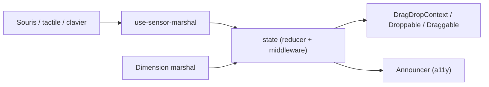

# atlassian/react-beautiful-dnd

> Bibliothèque React de glisser-déposer pour listes, avec accessibilité clavier et lecteur d'écran, aujourd'hui archivée.

## Le problème
Le glisser-déposer natif HTML5 est incohérent selon les navigateurs et ignore le clavier et les lecteurs d'écran pour réordonner des listes.

## Ce que ça fait vraiment
Fournit trois composants (DragDropContext, Droppable, Draggable) pour listes verticales, horizontales, multi-listes et imbriquées. Le code interne suit un flux à la Redux : capteurs souris, tactile et clavier, marshal de dimensions, calcul d'impact, auto-scroll et annonceur d'accessibilité. Les capteurs sont extensibles.

## Comment c'est branché

## Essayer
Aucune commande dans le README : l'installation est renvoyée à la documentation (dossier docs).

## Coût et pièges
Gratuit, mais le projet est archivé et déprécié sur npm (dernier push le 2025-08-18), avec 642 issues ouvertes. La licence n'est pas identifiée par GitHub.

## Ce que ce n'est pas
Ce n'est pas maintenu : aucun correctif à attendre. Il ne couvre pas les cas hors listes, contrairement à react-dnd, que le README cite.

## Alternatives
- Pragmatic drag and drop : successeur proposé par Atlassian.
- react-dnd : primitives plus larges que le seul cas des listes.

## Pour toi
À ignorer : archivé et déprécié, et de toute façon un composant d'interface React sans lien avec data/IA ; privilégier le successeur d'Atlassian.

