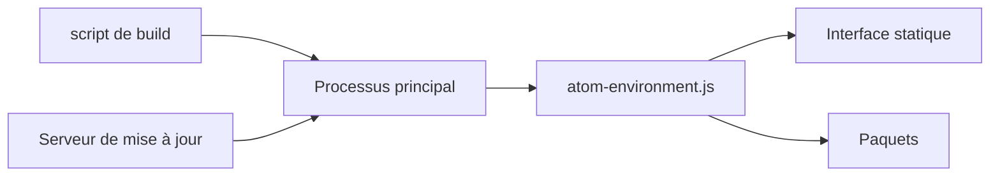

# atom/atom

> Éditeur de texte extensible basé sur Electron, arrêté et archivé.

## Le problème
Disposer d'un éditeur configurable en JavaScript et en paquets, à l'époque où peu d'éditeurs l'étaient.

## Ce que ça fait vraiment
Atom est un éditeur de bureau Electron dont le noyau (`src`, processus principal et rendu) charge des paquets fournis dans `packages`. Il se met à jour seul sur macOS et Windows, et par archive sur Linux. Le README annonce l'archivage du dépôt au 15 décembre 2022 ; le catalogue confirme : archivé, dernier push en 2023-01-03.

## Comment c'est branché


## Essayer
```bash
tar xf atom-amd64.tar.gz
```
Après installation des dépendances Ubuntu listées dans le README.

## Coût et pièges
Gratuit, mais plus aucune mise à jour ni correctif de sécurité. Sur Linux, pas de mise à jour automatique.

## Ce que ce n'est pas
Ce n'est pas un projet vivant : ne pas le déployer sur une machine de travail.

## Alternatives
Aucune alternative nommée dans le README.

## Pour toi
Ignorer : dépôt archivé, sans correctifs ; choisis un éditeur maintenu.

