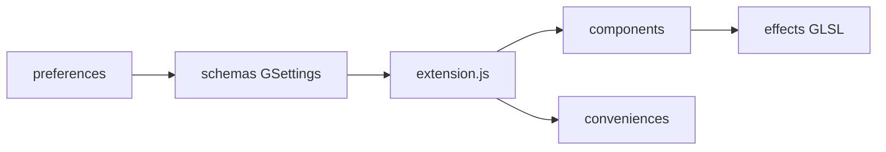

# aunetx/blur-my-shell

> Extension GNOME Shell qui applique un flou au panneau, au dock, à l'aperçu et aux fenêtres.

## Le problème
GNOME Shell n'offre pas d'effet de flou paramétrable pour ses éléments d'interface.

## Ce que ça fait vraiment
Applique un flou statique (image de fond passée dans des pipelines d'effets : gaussien, Monte Carlo, pixélisation, coins) ou dynamique (flou de ce qui est derrière) sur panneau, Dash to Dock, aperçu, dossiers d'apps, popups, écran de verrouillage et applications choisies. Des réglages gèrent les artefacts. Compatible avec Dash to Panel, Just Perfection et d'autres extensions.

## Comment c'est branché


## Essayer
```bash
git clone https://github.com/aunetx/blur-my-shell
cd blur-my-shell
make install
```

## Coût et pièges
Gratuit. Le flou peut ralentir GNOME Shell (Monte Carlo à beaucoup d'itérations, option « No artifact »). Plusieurs moniteurs : gestion possiblement incorrecte.

## Ce que ce n'est pas
Pas un thème complet : uniquement du flou. Ne fonctionne que sous GNOME Shell.

## Alternatives
Aucune alternative nommée dans le README.

## Pour toi
À ignorer : cosmétique de bureau Linux, aucun rapport avec ton métier.

