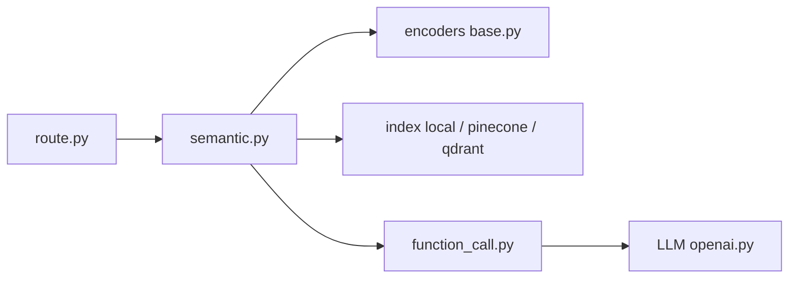

# aurelio-labs/semantic-router

> Couche de décision par similarité sémantique qui route les requêtes avant d'appeler un LLM.

## Le problème
Laisser un LLM décider quel outil ou quel chemin emprunter est lent et coûteux.

## Ce que ça fait vraiment
On définit des `Route` avec des exemples d'énoncés, on choisit un encodeur (Cohere, OpenAI, Hugging Face, FastEmbed, multimodal) et un `SemanticRouter`. Une requête est comparée aux routes par similarité et renvoie le nom de la route, ou `None` sans correspondance. Variantes : routeur hybride, routes dynamiques avec extraction de paramètres par LLM, optimisation de seuils, index locaux, Pinecone, Qdrant ou Postgres.

## Comment c'est branché


## Essayer
```bash
pip install -qU semantic-router
pip install -qU "semantic-router[local]"
pip install -qU "semantic-router[hybrid]"
```
Le README montre ensuite la définition de routes et `SemanticRouter(encoder=encoder, routes=routes, auto_sync="local")`.

## Coût et pièges
Chaque encodeur distant est facturé à l'appel (Cohere, OpenAI). Une version locale existe avec `HuggingFaceEncoder` et `LlamaCppLLM`. Le README mêle des noms anciens (`RouteLayer`) et récents (`SemanticRouter`).

## Ce que ce n'est pas
Pas un agent : il décide d'une route, il n'exécute rien. La qualité dépend de tes énoncés d'exemple et de tes seuils.

## Alternatives
Aucune alternative citée dans le README.

## Pour toi
À surveiller : brique simple et rapide pour filtrer ou orienter des requêtes avant un LLM, à tester sur tes propres intentions.

