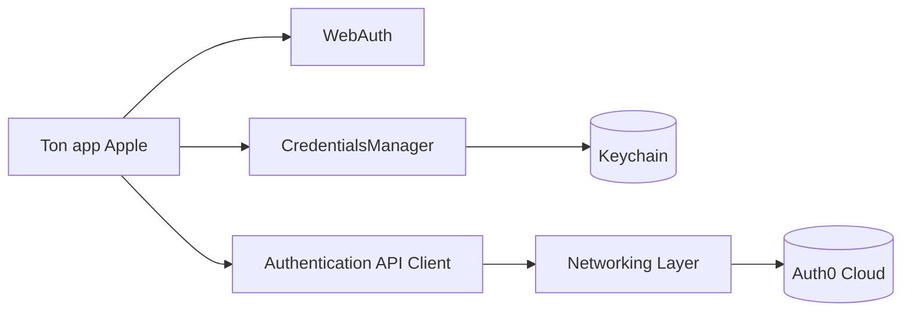

# auth0/Auth0.swift

> SDK Swift pour authentifier des utilisateurs avec Auth0 dans des apps iOS, macOS, tvOS, watchOS et visionOS.

## Le problème
Intégrer une connexion sécurisée (connexion universelle, stockage des jetons, renouvellement, MFA) à une app Apple exige beaucoup de code sensible.

## Ce que ça fait vraiment
Fournit `WebAuth` (page de connexion universelle avec PKCE), un client d'API d'authentification, un client MFA (accès anticipé), un `CredentialsManager` qui stocke les jetons dans le Keychain et les renouvelle, et une validation JWT/JWK locale. Compatible callbacks, async/await et Combine. La v3 apporte des ruptures.

## Comment c'est branché


## Essayer
```bash
npx skills add auth0/agent-skills --skill auth0
pod install
carthage bootstrap --use-xcframeworks
```
Installation Swift Package Manager via Xcode avec l'URL `https://github.com/auth0/Auth0.swift`.

## Coût et pièges
Il faut un compte Auth0 et une application de type Native (Client ID et Domain). Les Universal Links exigent un compte développeur Apple payant. Xcode 26 et Swift 6.0+ requis.

## Ce que ce n'est pas
Ce n'est pas un serveur d'identité : il dépend du service Auth0. Le MFA et l'expiration IPSIE sont en accès anticipé.

## Alternatives
Le README ne cite aucune alternative.

## Pour toi
À ignorer : SDK d'authentification mobile lié à un SaaS, sans rapport avec un travail data/IA/MLOps.

