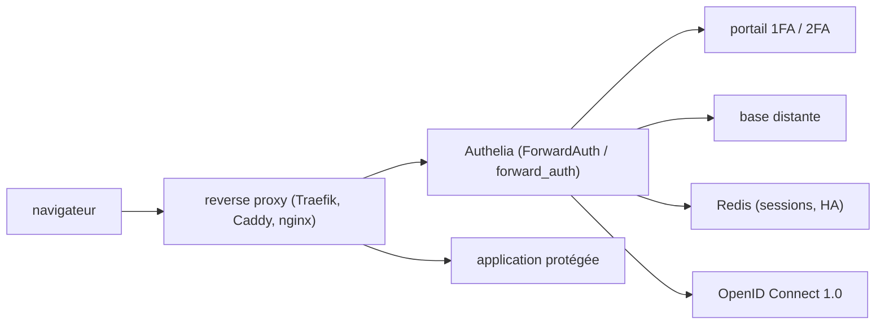

# authelia/authelia

> Serveur d'authentification et SSO qui s'adosse à un reverse proxy pour protéger des applications.

## Le problème
Chaque application auto-hébergée réimplémente son login, sans second facteur ni politique commune.
Protéger un service sans authentification native oblige à bricoler au niveau du proxy.

## Ce que ça fait vraiment
Portail web d'authentification : le reverse proxy lui délègue chaque requête, qui est autorisée, refusée ou redirigée.
Second facteur au choix : clés FIDO2/WebAuthn, TOTP, notifications push Duo, passkeys sans mot de passe.
Règles d'accès fines par sous-domaine, utilisateur, groupe, URI, méthode et réseau ; politique un ou deux facteurs par règle.
Fournisseur OpenID Connect 1.0 / OAuth 2.0 certifié (profils Basic, Implicit, Hybrid, Form Post, Config), cryptographie post-quantique.

## Comment c'est branché

## Essayer
Aucune commande d'installation n'est écrite dans le README : il renvoie vers AUR, APT, FreeBSD Ports, binaire statique, paquet .deb, Docker, Kubernetes et le chart Helm (bêta), plus les bundles `docker compose` Local et Lite.

## Coût et pièges
Le bundle Local utilise des certificats auto-signés ; le bundle Lite exige domaines, DNS et LetsEncrypt configurés.
La haute disponibilité impose une base distante et Redis : la configuration Lite (fichier + SQLite) ne monte pas en charge.

## Ce que ce n'est pas
Ce n'est pas exposé directement sur Internet : ce sont tes reverse proxies qui le sont, Authelia reste le plan de contrôle interne.
Ce n'est pas stable en version : le projet prévient des ruptures et recommande d'épingler un tag plutôt que `latest`.
Le support OpenID Connect reste annoncé comme bêta malgré la certification.

## Alternatives
SWAG (LinuxServer) : configuration clés en main qui embarque Authelia, si l'on part de zéro.

## Pour toi
Hors sujet data/IA, sauf si tu exposes toi-même des applis internes (MLflow, Label Studio) derrière un proxy.
