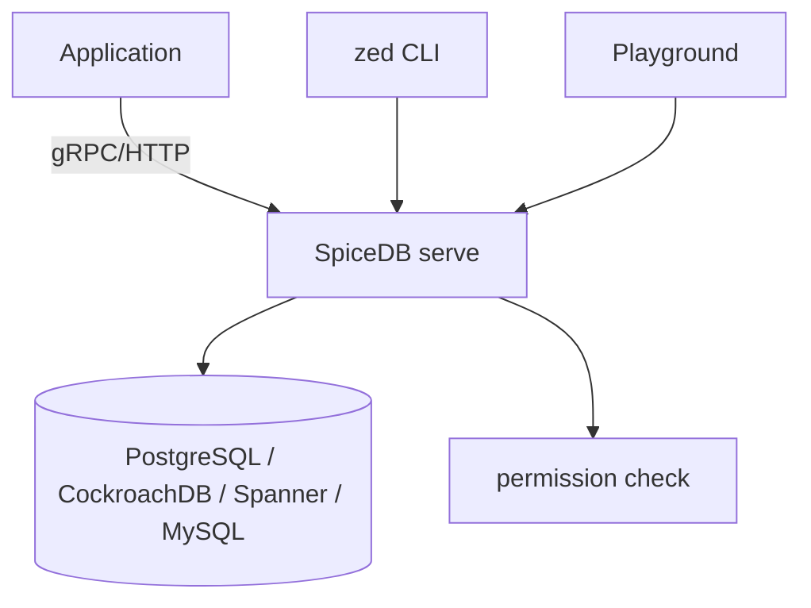

# authzed/spicedb

> Base de données d'autorisations open source inspirée de Zanzibar de Google.

## Le problème
Le contrôle d'accès cassé est le risque n°1 OWASP 2021. Coder « X peut-il faire Y sur Z ? » dans chaque microservice mène à des règles éparpillées, incohérentes et impossibles à interroger en sens inverse.

## Ce que ça fait vraiment
Comme une base relationnelle : on définit un **schéma**, on écrit des **relations**, puis les clients lancent des **checks de permission**. Répond aussi à « que peut faire X ? » et « qui accède à Z ? » via index inverses. Cohérence configurable par requête. Purement autorisation, agnostique de l'authentification. Datastores : Spanner, CockroachDB, MySQL, PostgreSQL.

## Comment c'est branché


## Essayer
```shell
brew install authzed/tap/spicedb authzed/tap/zed
```
```shell
docker run --rm -p 50051:50051 -p 8443:8443 authzed/spicedb serve --http-enabled true --grpc-preshared-key "somerandomkeyhere"
```

## Coût et pièges
Cœur open source gratuit ; AuthZed Cloud est le service managé payant. Télémétrie anonyme opt-out (`--telemetry-endpoint=""`). Nécessite un datastore de production.

## Ce que ce n'est pas
Pas un fournisseur d'identité : il ne gère pas l'authentification. Pas une base généraliste : dédié aux relations d'autorisation.

## Alternatives
Non nommées dans le README (renvoie vers le papier Zanzibar comme référence, pas vers des concurrents).

## Pour toi
À connaître si tu montes une plateforme multi-services avec autorisation fine centralisée ; sinon hors périmètre data/IA direct.
