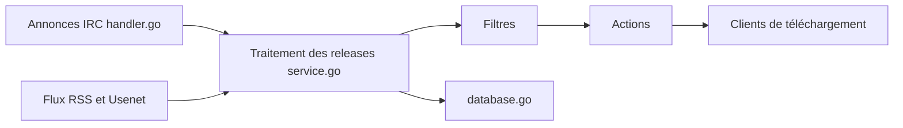

# autobrr/autobrr

> Automatisation de téléchargements torrent et Usenet : surveille les annonces IRC des trackers et envoie les fichiers filtrés aux clients.

## Le problème
Les flux RSS sont trop lents pour rejoindre l'essaim initial d'un torrent et maintenir son ratio sur les trackers privés.

## Ce que ça fait vraiment
Écoute les canaux IRC des indexeurs, applique des filtres (regex possibles) puis déclenche des actions : envoi à qBittorrent, Deluge, rTorrent, Transmission, aux applications *arr, SABnzbd/NZBGet, dossier surveillé, script ou webhook. Gère aussi RSS, Torznab, Newznab, des notifications, l'authentification (intégrée ou OIDC) et SQLite ou PostgreSQL.

## Comment c'est branché


## Essayer
```bash
docker compose up -d
brew install autobrr
brew services start autobrr
```
(Le `docker-compose.yml` est donné dans le README avec l'image `ghcr.io/autobrr/autobrr:latest`, port 7474.)

## Coût et pièges
Gratuit. Il faut des comptes chez des trackers et un client. L'image distroless n'a pas de shell : les scripts `exec` en bash ne fonctionnent pas. Par défaut l'écoute est sur 127.0.0.1 ; prévoir un reverse proxy.

## Ce que ce n'est pas
Ni un client torrent ni un indexeur. Le README n'aborde pas la légalité des contenus téléchargés. Licence GPL-2.0 (copyleft).

## Alternatives
Radarr et Sonarr (via RSS) sont cités comme outils complémentaires, plus lents pour l'essaim initial.

## Pour toi
Ignorer : sans rapport avec data/IA/MLOps, c'est un outil de seedbox personnel.

