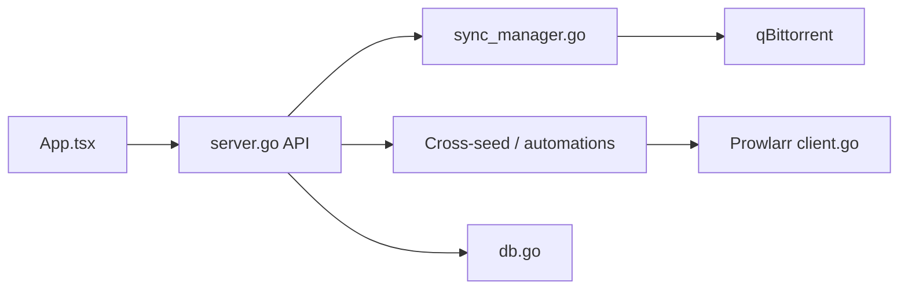

# autobrr/qui

> Interface web légère pour gérer plusieurs instances qBittorrent depuis une seule application.

## Le problème
Administrer plusieurs clients qBittorrent séparés, avec des collections volumineuses, est lent et dispersé.

## Ce que ça fait vraiment
Un binaire unique sert une interface qui synchronise avec chaque instance qBittorrent, avec cross-seed automatique, règles d'automatisation, sauvegardes planifiées et restauration, scans de dossiers, proxy inverse transparent et intégration Prowlarr. Interface en onze langues. Des thèmes premium sont vendus.

## Comment c'est branché


## Essayer
```bash
wget $(curl -s https://api.github.com/repos/autobrr/qui/releases/latest | grep browser_download_url | grep linux_x86_64 | cut -d\" -f4)
sudo tar -C /usr/local/bin -xzf qui*.tar.gz qui
qui serve
docker run -d -p 7476:7476 -v $(pwd)/config:/config ghcr.io/autobrr/qui:latest
```

## Coût et pièges
Gratuit ; thèmes premium payants. Le README liste des adresses de donation en cryptomonnaies : ne rien envoyer sans vérification. Licence GPL-2.0.

## Ce que ce n'est pas
Pas un client torrent : il pilote qBittorrent.

## Alternatives
- VueTorrent, iQbit, Flood, qBitController : interfaces alternatives citées dans le README.

## Pour toi
À ignorer : gestion de torrents sans lien avec data, IA ou MLOps.

