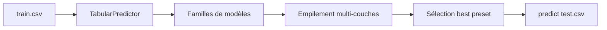

# autogluon/autogluon

> AutoML qui choisit et empile les modèles pour tabulaire, séries temporelles et multimodal.

## Le problème
Choisir entre modèles classiques et modèles de fondation sur données tabulaires prend des jours,
et l'empilement manuel de modèles est fastidieux à écrire comme à valider.

## Ce que ça fait vraiment
Trois prédicteurs d'entrée unique : `TabularPredictor`, `TimeSeriesPredictor`, `MultiModalPredictor`.
Le `fit` prend un CSV et un `label`, entraîne plusieurs familles de modèles, les empile et sélectionne
la meilleure combinaison via des presets (`best`). Adossé à une lignée de publications (TabRepo, Chronos,
Mitra, TabArena, MLZero). Python 3.10 à 3.13, Linux, macOS, Windows.

## Comment c'est branché


## Essayer
```bash
pip install autogluon
```
```python
from autogluon.tabular import TabularPredictor
predictor = TabularPredictor(label="class").fit("train.csv", presets="best")
predictions = predictor.predict("test.csv")
```

## Coût et pièges
Gratuit en local. Le support GPU, les installs Conda et les dépendances optionnelles passent par le guide
d'installation. Le déploiement cloud recommandé (AutoGluon Cloud, conteneurs DLC, SageMaker Autopilot) se facture.

## Ce que ce n'est pas
Pas un outil de préparation de données : il attend un jeu déjà propre avec une colonne cible.
Pas une boîte transparente : le preset `best` construit un ensemble lourd, coûteux à l'inférence.
Aucune licence n'est indiquée dans le README.

## Alternatives
- **Amazon SageMaker Autopilot** : le même moteur, en managé.
- **AutoGluon Cloud** : recommandé par le projet pour l'entraînement distant.

## Pour toi
Le réflexe par défaut pour un baseline tabulaire ou une prévision : trois lignes, résultat solide.
