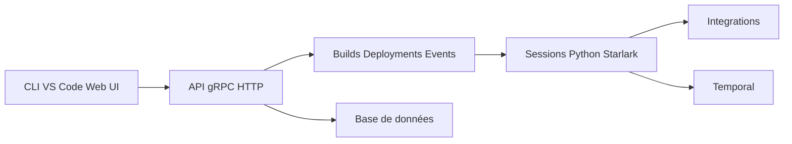

# autokitteh/autokitteh

> Plateforme d'automatisation de workflows en Python, durable grâce à Temporal, auto-hébergée ou cloud (dépôt archivé).

## Le problème
Les outils no-code (Zapier, n8n) limitent la logique ; écrire soi-même des workflows durables et reprenables est complexe.

## Ce que ça fait vraiment
Serveur Go avec API gRPC/HTTP : projets, builds, déploiements, déclencheurs (webhooks, planification), sessions exécutées en Python ou Starlark (JavaScript annoncé), intégrations (Slack, GitHub, Twilio, ChatGPT, Gemini, Gmail…). Repose sur Temporal pour la durabilité. CLI, extension VS Code et interface web.

## Comment c'est branché


## Essayer
```bash
git clone https://github.com/autokitteh/autokitteh.git
cd autokitteh
make ak
cp ./bin/ak /usr/local/bin
ak version
```

## Coût et pièges
Go 1.24 minimum ; les builds complets demandent aussi buf et Docker. L'offre cloud est en bêta, contact par courriel. Dépôt archivé : plus de mises à jour.

## Ce que ce n'est pas
Ce n'est pas un outil ML : il orchestre des tâches générales, y compris MLOps selon le README, sans rien de spécifique au ML.

## Alternatives
- n8n : plateforme no-code citée par le README.
- Temporal : moteur d'exécution durable sur lequel AutoKitteh repose.

## Pour toi
Ignorer : archivé, donc à ne pas démarrer ; pour l'orchestration durable, regarder Temporal directement.

