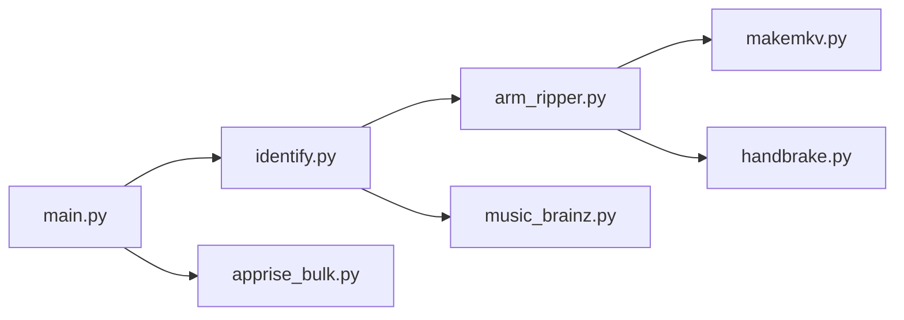

# automatic-ripping-machine/automatic-ripping-machine

> Serveur qui détecte un disque optique inséré, l'identifie et le copie ou le transcode automatiquement.

## Le problème
Numériser une collection de disques Blu-ray, DVD et CD à la main est long et répétitif.

## Ce que ça fait vraiment
Détecte l'insertion via udev, identifie audio, vidéo ou données, nomme les films via l'API OMDb, rip avec MakeMKV ou HandBrake, les CD avec abcde et MusicBrainz, fait une ISO pour les données. Transcodage asynchrone, plusieurs lecteurs en parallèle, notifications (IFTTT, Slack, Discord…) et interface Flask pour suivre les jobs.

## Comment c'est branché

## Essayer
Aucune commande documentée dans le README fourni : il renvoie au wiki pour l'installation normale, Docker et WSL.

## Coût et pièges
Gratuit. Il faut un ou plusieurs lecteurs optiques et beaucoup d'espace disque (NAS suggéré). L'identification s'appuie sur OMDb.

## Ce que ce n'est pas
Pas un outil de gestion de médiathèque : il produit les fichiers, Plex ou Emby les lisent.

## Alternatives
Aucune alternative citée dans le README.

## Pour toi
À ignorer : sans rapport avec data, IA ou MLOps ; utile seulement pour un projet personnel de numérisation.

