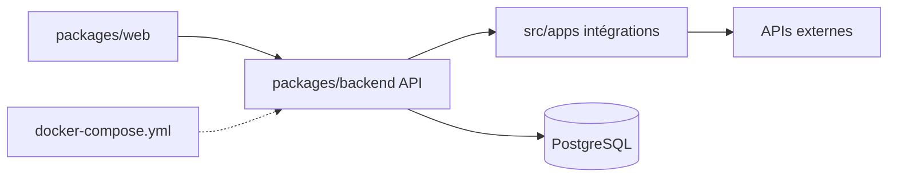

# automatisch/automatisch

> Alternative open source auto-hébergeable à Zapier pour automatiser des flux entre services, sans code.

## Le problème
Zapier et Integromat sont payants et hébergent tes données chez un tiers, ce qui gêne pour les données sensibles ou le RGPD.

## Ce que ça fait vraiment
Interface web (React) et API backend Node.js avec PostgreSQL (migrations Knex). Une couche « apps » modulaire, un dossier par intégration avec triggers, actions et authentification. Le code mentionne des modules « Enterprise » (fichiers `.ee.`) sous une licence distincte de la partie communautaire (AGPL, d'après l'architecture).

## Comment c'est branché


## Essayer
```bash
git clone https://github.com/automatisch/automatisch.git
cd automatisch
docker compose up
```

## Coût et pièges
Gratuit auto-hébergé. Identifiants par défaut `user@automatisch.io` / `sample` à changer. Dernier push le 2026-02-11 (plus de sept mois) ; 289 issues ouvertes.

## Ce que ce n'est pas
Pas un service hébergé clé en main ; chaque intégration dépend des API tierces.

## Alternatives
Zapier et Integromat, cités comme références payantes.

## Pour toi
À surveiller : pratique pour orchestrer de petits flux en interne, mais licence à clarifier (AGPL et EE) et rythme de commits en baisse.

