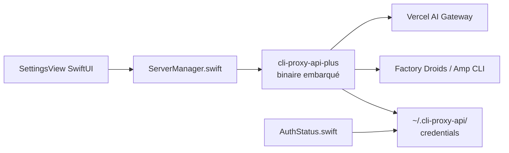

# automazeio/vibeproxy

> App macOS de barre de menus qui expose tes abonnements IA existants à des outils de code tiers.

## Le problème
Payer deux fois : un abonnement Claude ou ChatGPT d'un côté, une clé d'API facturée de l'autre.
Gérer OAuth, rafraîchissement de jetons et routage à la main pour chaque outil.

## Ce que ça fait vraiment
Interface SwiftUI native : démarrage/arrêt du serveur proxy, authentification OAuth pour Claude Code,
Codex, Gemini, Kimi, Qwen, Antigravity, et clé d'API pour Z.AI GLM.
Multi-comptes par fournisseur avec round-robin et bascule en cas de rate limit ; priorité des
fournisseurs à chaud. Option de routage des requêtes Claude via l'AI Gateway de Vercel.
Construit sur CLIProxyAPIPlus, dont le binaire est embarqué dans le `.app`.

## Comment c'est branché

## Essayer
Aucune commande : télécharger `VibeProxy-arm64.zip` (ou `x86_64`) depuis les Releases,
glisser `VibeProxy.app` dans `/Applications`, lancer. Build depuis les sources : voir `INSTALLATION.md`.

## Coût et pièges
macOS 13+ seulement, build Intel non testée. L'app est gratuite mais suppose des abonnements payants.
Le README admet lui-même le sujet : l'AI Gateway est présenté comme « plus sûr » pour éviter
« les risques pour le compte liés à l'usage direct des jetons OAuth ».

## Ce que ce n'est pas
Ce n'est pas un fournisseur de modèles ni un proxy neutre : c'est un pont qui détourne des jetons
d'abonnement vers des clients non prévus par les fournisseurs. Ce n'est pas multiplateforme.
Ce n'est pas le cœur technique : celui-ci est CLIProxyAPIPlus.

## Alternatives
CLIProxyAPIPlus, le proxy sous-jacent, si tu n'as pas besoin de l'interface macOS.

## Pour toi
À éviter en contexte professionnel : le risque de compte et de conformité est porté par toi.
