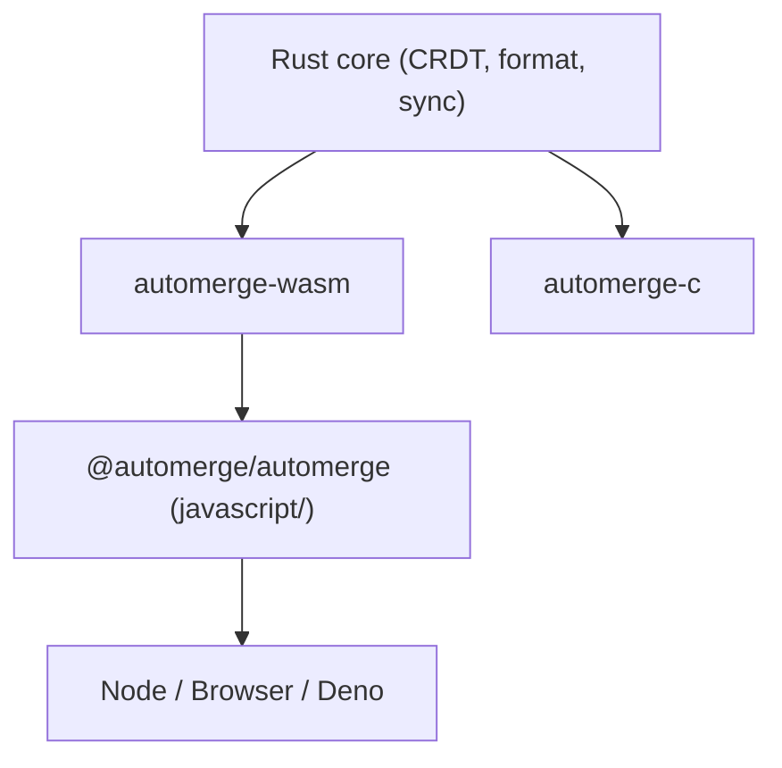

# automerge/automerge

> Bibliothèque de CRDT en Rust, exposée en JavaScript/WASM et C, pour applications local-first synchronisées.

## Le problème
Faire éditer les mêmes données par plusieurs personnes hors ligne, puis fusionner sans conflit, est un problème de systèmes distribués difficile.

## Ce que ça fait vraiment
Implémente plusieurs CRDT, un format binaire compact et un protocole de synchronisation. Le cœur est en Rust, compilé en WebAssembly pour le paquet `@automerge/automerge`, avec une liaison C (`rust/automerge-c`). Automerge 3 annonce environ 10× moins de mémoire. L'API Rust est dite bas niveau et peu documentée.

## Comment c'est branché


## Essayer
```bash
git clone https://github.com/automerge/automerge
cd automerge
npm --prefix ./javascript install
cargo install wasm-bindgen-cli wasm-opt cargo-deny
./scripts/ci/run
```

## Coût et pièges
Gratuit. Construire depuis les sources exige Rust (nightly pour le wasm), Node, cmake et plusieurs outils cargo ; le paquet npm évite cela.

## Ce que ce n'est pas
Pas une base de données ni un serveur de synchronisation clé en main : une bibliothèque de structures de données. Pas de réseau fourni ici.

## Alternatives
- autosurgeon : pour construire des applications Rust au-dessus d'Automerge.

## Pour toi
À surveiller : pertinent seulement si tu construis des outils collaboratifs local-first ; peu utile pour un pipeline data classique.

