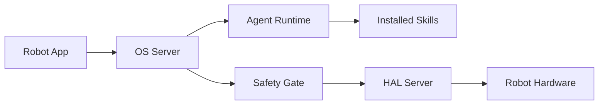

# autonomous-ai/autonomous-os

> Système d'exploitation open source pour robots, avec moteur d'agent, compétences en Markdown et couche matérielle.

## Le problème
Les robots grand public restent pilotés à la télécommande ou limités à des démonstrations scriptées.

## Ce que ça fait vraiment
Une pile logicielle en couches : démon Go `os-server` (port 5000), HAL Python (port 5001, 13 capacités déclarées), moteur d'agent interchangeable (Hermes, OpenClaw, PicoClaw, Codex, Claude Code, OpenCode) et voix temps réel. Chaque robot est décrit par `ROBOT.md`, `SOUL.md`, `SAFETY.md` et des `SKILL.md`. Une porte de sécurité, indépendante du modèle, borne luminosité, heures calmes et vitesse.

## Comment c'est branché


## Essayer
```bash
ssh pollen@reachy-mini.local
curl -fsSL https://raw.githubusercontent.com/autonomous-ai/autonomous-os/main/robots/reachy-mini/install.sh | sudo bash
make os-build && make os-test
make cts
```

## Coût et pièges
Suppose un robot compatible (Lamp, Reachy Mini, Intern, cartes Pi 4/5, CM4, OrangePi) et l'application mobile. Le moteur d'agent peut nécessiter des clés de modèles. La porte de sécurité ne couvre pas tout : voir `docs/safety.md`.

## Ce que ce n'est pas
Pas un système temps réel : le contrôle de position reste dans le firmware des servos. Ce n'est pas installable sans matériel.

## Alternatives
Aucune alternative nommée dans le README.

## Pour toi
Ignorer : domaine robotique matériel, sans lien avec un travail data/MLOps courant, sauf projet embarqué précis.
