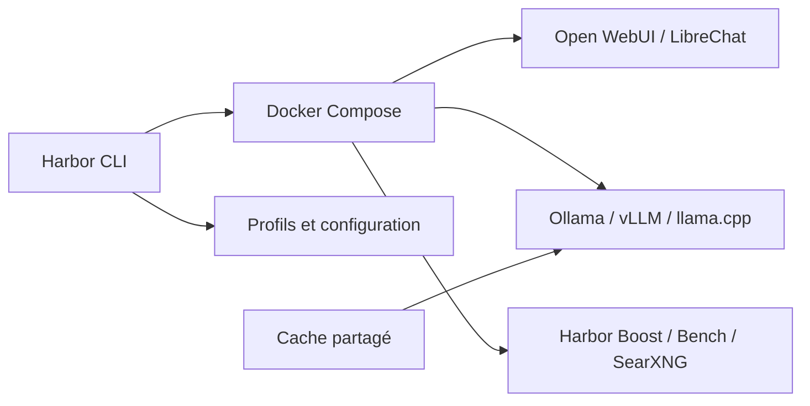

# av/harbor

> CLI qui lance en conteneurs une pile LLM locale (interfaces, moteurs, services annexes) en une commande.

## Le problème
Assembler Ollama, vLLM, Open WebUI, SearXNG, etc. avec leurs réseaux, volumes et configurations demande beaucoup de compose à la main.

## Ce que ça fait vraiment
Mise en garde : le nom du dépôt vient d'un en-tête non lu ; « av/harbor » est une déduction à vérifier, et seul le bas du README (« single CLI with a lot of services ») et le schéma sont disponibles. D'après le schéma, Harbor CLI orchestre Docker Compose, gère profils, configuration et cache partagé (HuggingFace, Ollama). Frontends : Open WebUI, ComfyUI, LibreChat. Backends : Ollama, llama.cpp, vLLM, TabbyAPI. Satellites : Harbor Bench, Harbor Boost, SearXNG. Une application compagnon existe (Harbor App).

## Comment c'est branché

## Essayer
Non documenté dans la partie lue du README (les commandes d'installation ne figuraient pas dans l'extrait).

## Coût et pièges
Docker requis ; GPU pour les gros modèles (non confirmé dans la partie lue). Licence et activité du dépôt non lisibles ici (bloc d'identité non lu).

## Ce que ce n'est pas
Pas un moteur d'inférence : il orchestre des moteurs existants.

## Alternatives
Non documenté dans la partie lue du README.

## Pour toi
Surveiller : l'idée (pile LLM locale reproductible) sert un profil MLOps, mais il faut relire le README complet avant de trancher.
