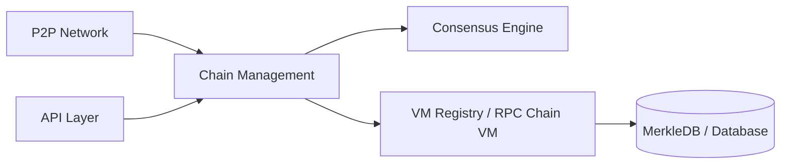

# ava-labs/avalanchego

> Implémentation Go d'un nœud du réseau blockchain Avalanche, pour opérateurs de nœuds et développeurs de VM.

## Le problème
Participer au réseau Avalanche suppose d'exécuter un nœud qui valide les blocs et sert les API.

## Ce que ça fait vraiment
Le binaire `avalanchego` rejoint le Mainnet ou le testnet Fuji, se synchronise (plusieurs jours pour un nouveau nœud, limité par les E/S disque), puis participe au consensus. D'après le code décrit : réseau pair à pair, gestion des chaînes (P, C, X), machines virtuelles (dont `rpcchainvm` pour VM externes), API (admin, santé, info, keystore) et base MerkleDB. Version alignée sur celle du réseau.

## Comment c'est branché


## Essayer
```bash
git clone git@github.com:ava-labs/avalanchego.git
cd avalanchego
./scripts/run_task.sh build
./build/avalanchego
./build/avalanchego --network-id=fuji
```

## Coût et pièges
Matériel minimal recommandé : 8 vCPU, 16 Gio de RAM, 1 Tio de stockage, port public ouvert. Go 1.25.10+ pour compiler. La synchronisation initiale prend plusieurs jours. Les interfaces des paquets Go peuvent changer d'un correctif à l'autre.

## Ce que ce n'est pas
Ce n'est pas une bibliothèque Go stable : la version suit celle du réseau. « Blazing fast » est le slogan du README, sans mesure fournie.

## Alternatives
avalanche-cli (nommé dans le README) pour lancer un réseau local de test.

## Pour toi
À ignorer : exploiter un nœud blockchain n'apporte rien à un travail data, IA ou MLOps, sauf analyse on-chain ciblée.

