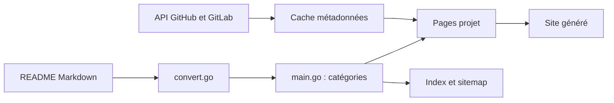

# avelino/awesome-go

> Annuaire collaboratif de bibliothèques et logiciels Go, classés par catégories, pour développeurs Go.

## Le problème
Choisir une bibliothèque Go (CLI, base de données, logs, web…) sans savoir ce qui existe ni ce qui est maintenu.

## Ce que ça fait vraiment
Un README géant, classé en dizaines de catégories (Actor Model, Artificial Intelligence, Database, Web Frameworks…), avec une ligne par projet. Le dépôt contient aussi un programme Go qui convertit le Markdown en site statique : pages par projet, index, sitemap, et métadonnées GitHub/GitLab mises en cache. Les ajouts passent par pull request ; le README invite à signaler les paquets non maintenus.

## Comment c'est branché

## Essayer
Aucune commande documentée : on parcourt la liste (ou le site généré) et on ouvre une PR pour contribuer.

## Coût et pièges
Aucun coût. La liste est énorme : la présence d'un projet ne dit rien de sa qualité ni de sa vitalité.

## Ce que ce n'est pas
Ni un registre de paquets ni un classement qualité : c'est une liste curée, avec des doublons de noms (plusieurs « jwt », « retry »). Les sponsors financent des personnes qui font tourner le projet.

## Alternatives
- awesome-python : le modèle dont il s'inspire, pour l'écosystème Python.

## Pour toi
Adopter comme référence quand un projet Go t'attend (outillage, ML, MCP) : tu y trouveras vite des candidats, à vérifier un par un avant de les retenir.

