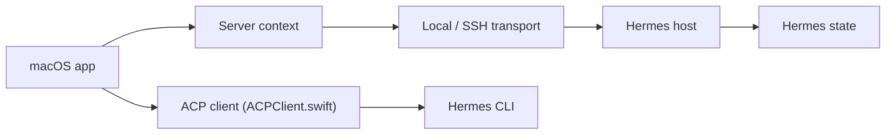

# awizemann/scarf

> App native Mac et iOS pour visualiser et piloter un agent Hermes, en local ou par SSH.

## Le problème
L'agent Hermes se pilote en terminal et par messagerie ; ses sessions, coûts, mémoire et tâches cron restent peu visibles.

## Ce que ça fait vraiment
App SwiftUI qui lit l'état de Hermes (`state.db` en lecture seule, config, logs, mémoire, skills) et passe les actions par la CLI `hermes`. Tableaux de bord de sessions, coûts et jetons, chat (protocole ACP ou terminal), éditeur de mémoire et de skills, cron, serveurs MCP, plateformes de messagerie, projets avec tableaux Kanban. ScarfGo (iPhone) se connecte en SSH. Compatible Hermes v0.6 à v0.21.

## Comment c'est branché


## Essayer
```bash
git clone https://github.com/awizemann/scarf.git
cd scarf/scarf
open scarf.xcodeproj
xattr -d com.apple.quarantine /Applications/Scarf.app
```
Ou télécharger la version signée depuis les Releases.

## Coût et pièges
Gratuit. Exige Hermes sur chaque hôte (v0.6+), macOS 14.6+ et, pour les hôtes distants, SSH par clé avec `sqlite3` et `pgrep`. L'app macOS envoie des statistiques d'usage anonymes (désactivables) ; ScarfGo n'envoie rien. Le bac à sable est désactivé, donc pas d'App Store pour la version Mac.

## Ce que ce n'est pas
Ce n'est pas un agent : c'est un client de gestion pour Hermes. Inutile sans cet agent.

## Alternatives
Aucune alternative nommée dans le README.

## Pour toi
À ignorer, sauf si tu exploites déjà Hermes : c'est un accessoire d'un agent précis, sans valeur autonome pour data/IA/MLOps.

