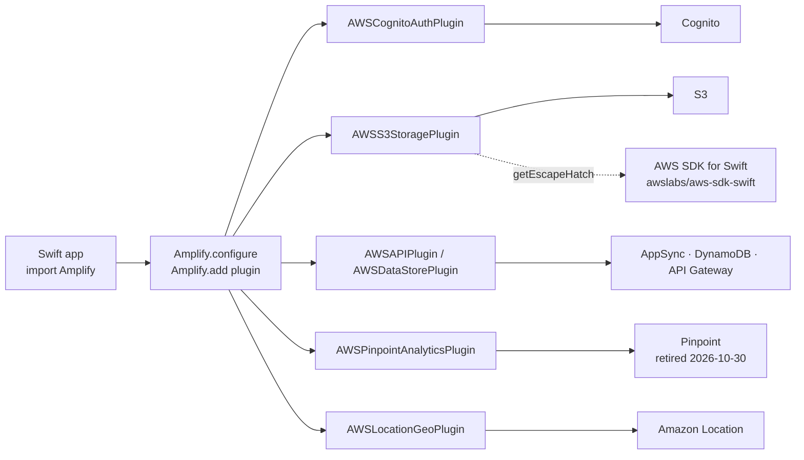

# aws-amplify/amplify-swift

> **Swift library exposing AWS auth, storage and data to Apple applications.**

## The problem

Wiring an iOS app to Cognito, S3, AppSync or API Gateway with the bare AWS SDK means writing
Sigv4 signing, token handling, upload resumption and offline sync yourself, service by service.

## What it actually does

Amplify Swift layers a declarative, per-*category* interface (Authentication, Storage, Analytics,
Geo, Data/GraphQL, DataStore, REST API, Predictions, Push Notifications) on top of the
AWS SDK for Swift, which stays the transport layer.

Each category is served by a *plugin* you add explicitly: `AWSCognitoAuthPlugin`,
`AWSS3StoragePlugin`, `AWSAPIPlugin`, `AWSDataStorePlugin`, `AWSLocationGeoPlugin`,
`AWSPinpointAnalyticsPlugin`. Calling code only sees `Amplify.Auth.signIn()` or
`Amplify.Storage.uploadFile()`.

The README stresses the pluggable design: the default implementation targets AWS, but the
interface is meant to be open to other backends. Anything not covered falls back to an escape
hatch (`plugin.getEscapeHatch()`) returning the raw SDK client — the example calls
`putBucketAccelerateConfiguration` on S3.

The repository also ships the `PrivacyInfo.xcprivacy` manifests the App Store requires, listing
the targets that use the User defaults APIs.

Two generations coexist: Gen2 covers Auth, Storage, Analytics, Geo and Data; DataStore, REST API,
Predictions and Push Notifications remain Gen1 only.

## How it is wired

No code-derived diagram exists for this repository: the graph below is reconstructed from the
README alone, from the plugin and service names it lists.



## Trying it

The documented install goes through the Xcode UI (**File > Add Packages**, the repo URL, the
*Up to Next Major Version* rule from `2.0.0`), not a shell command: the README provides no
command line at all. The bootstrap code it gives is this one.

```bash
# No shell command in the README: the package is added through Xcode.
# Documented Swift snippet, to run at application start-up:
#
#   import Amplify
#   import AWSCognitoAuthPlugin
#   import AWSAPIPlugin
#   import AWSDataStorePlugin
#
#   func initializeAmplify() {
#       do {
#           try Amplify.add(plugin: AWSCognitoAuthPlugin())
#           try Amplify.add(plugin: AWSAPIPlugin())
#           try Amplify.add(plugin: AWSDataStorePlugin())
#           try Amplify.configure()
#       } catch {
#           assertionFailure("Error initializing Amplify: \(error)")
#       }
#   }
```

## Cost and gotchas

- **Apple toolchain required**: Xcode 26.0 or later on every platform, Swift 6.0 minimum,
  iOS 15+ / macOS 12+ / tvOS 15+ / watchOS 9+ / visionOS 1+. So a Mac, and a developer account
  to ship.
- **AWS account to create, bill on you**: the library is Apache 2.0 and free, but Cognito, S3,
  AppSync, DynamoDB, API Gateway, Location and the Predictions services (Comprehend, Polly,
  Rekognition, Textract, Translate) are metered. The README documents no quota or free tier.
- **Pinpoint is being retired** on October 30, 2026, taking the Analytics and Push Notifications
  categories with it — two of the nine categories need a migration plan before you start.
- **Gen1 vs Gen2 is not cosmetic**: DataStore, REST API, Predictions and Push Notifications are
  not marked Gen2 in the feature table.
- **Forced language cadence**: the minimum Swift version tracks the minimum Xcode version App
  Store Connect allows, which Apple raises each April, with Amplify following within 60 days.
- **Privacy**: `AmplifyConnectClient` declares it can transmit email address, name, phone number,
  coarse location and device ID; the README asks you to narrow that declaration yourself.

## What it is not

- **Not a backend.** Nothing server-side ships here; this repo is the Swift client. Cognito pools,
  buckets and AppSync APIs are provisioned elsewhere, through the Amplify tooling documented on
  `docs.amplify.aws`, outside this repository.
- **Not a replacement for the AWS SDK**: it sits on top of it. Anything outside the nine
  categories falls back to `awslabs/aws-sdk-swift` or the escape hatch, with raw service types.
- **Not genuinely vendor-neutral**: "open and pluggable" describes the interface, not the
  existence of non-AWS implementations — the README names none.
- **Not cross-platform**: Swift and Apple platforms only.

## Alternatives

| | When to pick it |
|---|---|
| **awslabs/aws-sdk-swift** | Named in the README as the underlying layer and the escape hatch. Pick it when you want the raw AWS service, without the category layer, or a service outside the nine covered. |
| **ReactiveX/RxSwift** *(neighbour)* | Solves a different problem: composing asynchronous events inside the app. Amplify uses `async/await`, not streams; the two coexist rather than compete. |

The other catalogue neighbours (`airbnb/lottie-ios`, `onevcat/Kingfisher`,
`permissionlesstech/bitchat`) share the Swift language but not the domain: animation, image
caching, peer-to-peer messaging. No comparable backend-as-a-service alternative in the catalogue.

## For you

Skip it if your work is data / AI / MLOps: nothing here touches training, datasets or model
deployment — Predictions merely calls managed AWS services from a phone, and that category never
moved past Gen1. The one case where it matters is an iOS app to wire onto AWS infrastructure you
already run; otherwise the AWS account and Xcode toolchain cost more than they return.
