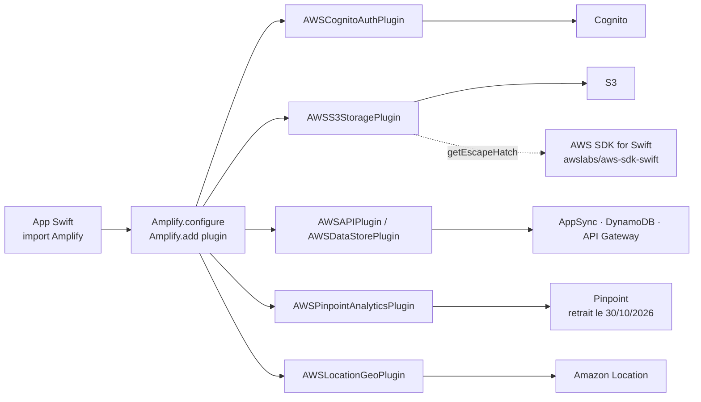

# aws-amplify/amplify-swift

> **Bibliothèque Swift qui expose auth, stockage et données AWS aux applications Apple.**

## Le problème

Brancher une application iOS sur Cognito, S3, AppSync ou API Gateway avec le seul SDK AWS
oblige à écrire soi-même la signature Sigv4, la gestion des jetons, la reprise d'envoi et la
synchronisation hors ligne, service par service et à la main.

## Ce que ça fait vraiment

Amplify Swift pose une couche déclarative par *catégorie* (Authentication, Storage, Analytics,
Geo, Data/GraphQL, DataStore, API REST, Predictions, Push Notifications) au-dessus du
[AWS SDK for Swift](https://aws.amazon.com/sdk-for-swift/), qui reste la couche de transport.

Chaque catégorie est servie par un *plugin* que l'on ajoute explicitement : `AWSCognitoAuthPlugin`,
`AWSS3StoragePlugin`, `AWSAPIPlugin`, `AWSDataStorePlugin`, `AWSLocationGeoPlugin`,
`AWSPinpointAnalyticsPlugin`. Le code appelant ne voit que `Amplify.Auth.signIn()` ou
`Amplify.Storage.uploadFile()`.

Le README insiste sur le caractère *pluggable* : l'implémentation par défaut vise AWS, mais
l'interface est ouverte à un autre backend. Pour tout ce qui n'est pas couvert, une
« escape hatch » (`plugin.getEscapeHatch()`) rend le client SDK brut — l'exemple donné appelle
`putBucketAccelerateConfiguration` sur S3.

Le dépôt fournit aussi les manifestes `PrivacyInfo.xcprivacy` exigés par l'App Store, avec la
liste des cibles utilisant les User defaults APIs.

Deux générations coexistent : Gen2 couvre Auth, Storage, Analytics, Geo et Data ; DataStore,
API REST, Predictions et Push Notifications restent Gen1 seulement.

## Comment c'est branché

Aucun diagramme tiré du code n'existe pour ce dépôt : ce schéma est reconstruit depuis le seul
README, à partir des noms de plugins et de services qu'il énumère.



## Essayer

L'installation documentée passe par l'interface d'Xcode (**File > Add Packages**, URL du dépôt,
règle *Up to Next Major Version* à partir de `2.0.0`), pas par une ligne de commande : le README
ne fournit aucune commande shell. Le code d'amorçage qu'il donne est celui-ci.

```bash
# Aucune commande shell dans le README : ajout du paquet via Xcode.
# Extrait Swift documenté, à placer au démarrage de l'application :
#
#   import Amplify
#   import AWSCognitoAuthPlugin
#   import AWSAPIPlugin
#   import AWSDataStorePlugin
#
#   func initializeAmplify() {
#       do {
#           try Amplify.add(plugin: AWSCognitoAuthPlugin())
#           try Amplify.add(plugin: AWSAPIPlugin())
#           try Amplify.add(plugin: AWSDataStorePlugin())
#           try Amplify.configure()
#       } catch {
#           assertionFailure("Error initializing Amplify: \(error)")
#       }
#   }
```

## Coût et pièges

- **Chaîne Apple obligatoire** : Xcode 26.0 ou plus pour toutes les plateformes, Swift 6.0
  minimum, iOS 15+ / macOS 12+ / tvOS 15+ / watchOS 9+ / visionOS 1+. Donc un Mac, et un
  compte développeur pour publier.
- **Compte AWS à créer, facture à ta charge** : la bibliothèque est sous Apache 2.0 et gratuite,
  mais Cognito, S3, AppSync, DynamoDB, API Gateway, Location et les services de Predictions
  (Comprehend, Polly, Rekognition, Textract, Translate) sont facturés à l'usage. Le README ne
  documente aucun quota ni palier gratuit.
- **Pinpoint est en fin de vie** : le README annonce sa retraite au 30 octobre 2026, ce qui
  emporte les catégories Analytics et Push Notifications. Deux catégories sur neuf sont donc à
  migrer avant de commencer.
- **Gen1 / Gen2 n'est pas cosmétique** : DataStore, API REST, Predictions et Push Notifications
  ne sont pas marqués Gen2 dans le tableau des fonctionnalités.
- **Suivi du langage imposé** : le minimum Swift suit le minimum Xcode d'App Store Connect,
  relevé chaque avril par Apple, et Amplify s'aligne dans les 60 jours. Les mises à jour ne
  sont pas optionnelles.
- **Vie privée** : `AmplifyConnectClient` déclare pouvoir transmettre adresse e-mail, nom,
  téléphone, localisation approximative et identifiant d'appareil ; le README demande de
  restreindre soi-même la déclaration au niveau de l'application.

## Ce que ce n'est pas

- **Ce n'est pas un backend.** Rien n'est fourni côté serveur : le dépôt est le client Swift.
  Les ressources (pool Cognito, bucket, API AppSync) se provisionnent ailleurs, via la chaîne
  Amplify documentée sur `docs.amplify.aws`, hors de ce dépôt.
- **Ce n'est pas un remplaçant du SDK AWS** : c'est une couche *au-dessus* de lui. Tout ce qui
  sort des neuf catégories retombe sur `awslabs/aws-sdk-swift` ou sur l'escape hatch, avec les
  types bruts du service.
- **Ce n'est pas réellement indépendant du fournisseur** : « open and pluggable » décrit
  l'interface, pas l'existence d'implémentations non-AWS — le README n'en cite aucune.
- **Ce n'est pas multiplateforme** : Swift et plateformes Apple uniquement.

## Alternatives

| | Quand le préférer |
|---|---|
| **awslabs/aws-sdk-swift** | Nommé dans le README comme la couche sous-jacente et l'échappatoire. À préférer quand on veut le service AWS brut, sans la couche catégorie, ou un service hors des neuf couverts. |
| **ReactiveX/RxSwift** *(voisin)* | Ne résout pas le même problème : composition d'événements asynchrones côté application. Amplify utilise `async/await`, pas des flux ; les deux cohabitent plutôt qu'ils ne se remplacent. |

Les autres voisins du catalogue (`airbnb/lottie-ios`, `onevcat/Kingfisher`,
`permissionlesstech/bitchat`) partagent le langage Swift mais pas le domaine : animation, cache
d'images, messagerie pair-à-pair. Aucune alternative comparable dans le catalogue pour la partie
backend-as-a-service.

## Pour toi

À ignorer si le travail est data / IA / MLOps : rien ici ne touche l'entraînement, les données
ou le déploiement de modèles — Predictions se contente d'appeler des services managés AWS depuis
un téléphone, et la catégorie est restée en Gen1. Le seul cas où ça compte est celui d'une
application iOS à câbler sur une infrastructure AWS déjà en place ; sinon, la dépendance à un
compte AWS et à la chaîne Xcode coûte plus qu'elle ne rapporte.
