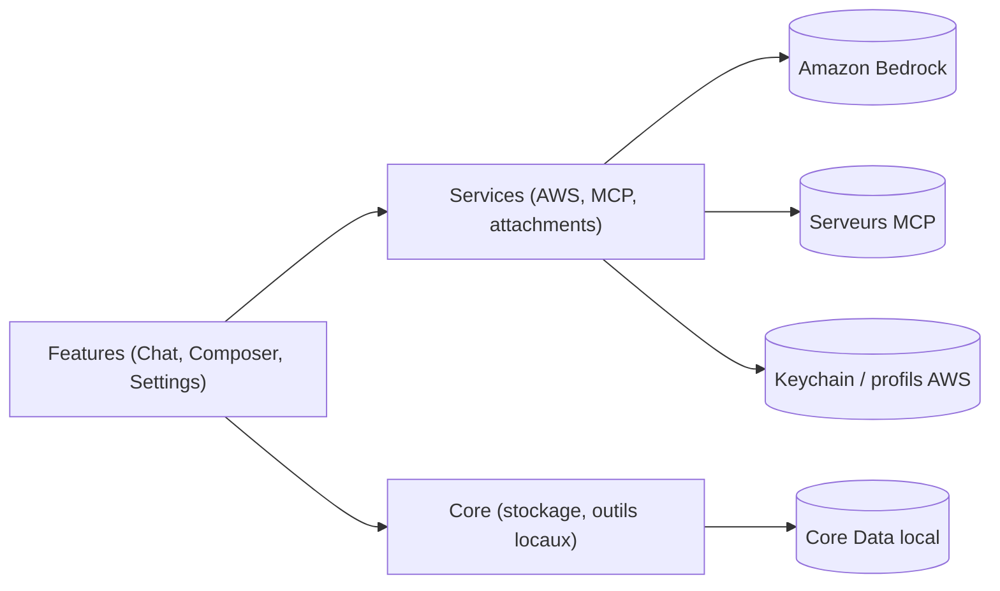

# aws-samples/amazon-bedrock-client-for-mac

> App Mac native (Swift) pour discuter avec les modèles d'Amazon Bedrock, avec outils locaux et MCP.

## Le problème
Utiliser Bedrock demande une console ou du code : il manque un client de bureau pour converser, joindre des documents et générer des images.

## Ce que ça fait vraiment
Client de conversation avec sélection de modèles, pièces jointes, historique local et recherche, file de messages, skills (`SKILL.md`), outils intégrés (fichiers, shell, Git) avec réglages d'approbation, connexions MCP (stdio, HTTP), automatisations planifiées et bibliothèque de démos. Les données restent sur le Mac ; les requêtes vont directement à Bedrock.

## Comment c'est branché


## Essayer
```bash
brew tap didhd/tap
brew install amazon-bedrock-client
aws sso login --profile your-profile
python3 scripts/ci.py
```

## Coût et pièges
L'inférence est facturée par AWS ; il faut un profil avec accès Bedrock, macOS 14+ et un accès réseau. Les outils locaux sont activés avec un accès permissif par défaut, et le shell tourne avec tes droits.

## Ce que ce n'est pas
Ce n'est pas un client hors ligne ni multi-fournisseur : il cible Bedrock. La génération vidéo exige un bucket S3 de sortie.

## Alternatives
Le README ne cite aucune alternative.

## Pour toi
À surveiller : client de bureau pratique si tu travailles sur Bedrock, mais son accès local permissif par défaut demande de resserrer les réglages.

