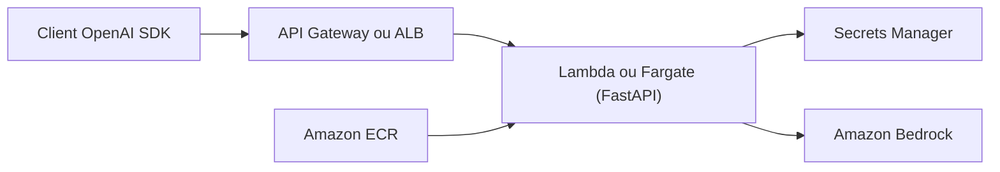

# aws-samples/bedrock-access-gateway

> Proxy d'API compatible OpenAI devant Amazon Bedrock, désormais déprécié au profit des API natives.

## Le problème
Utiliser les SDK OpenAI existants avec des modèles Bedrock sans changer le code.

## Ce que ça fait vraiment
Application FastAPI déployée par CloudFormation, soit API Gateway + Lambda (streaming SSE), soit ALB + Fargate. Traduit chat completions, embeddings, tool calls, multimodal, raisonnement, cache de prompts et profils d'inférence d'application vers Bedrock. La clé du proxy est stockée dans Secrets Manager.

## Comment c'est branché


## Essayer
```bash
git clone https://github.com/aws-samples/bedrock-access-gateway.git
cd bedrock-access-gateway/scripts
bash ./push-to-ecr.sh
```
Puis déploiement du template CloudFormation depuis la console AWS.

## Coût et pièges
Facturation AWS (Lambda ou Fargate, Bedrock, ECR) ; déploiement d'environ 10–15 minutes ; accès aux modèles Bedrock à demander. Le README annonce le projet déprécié.

## Ce que ce n'est pas
Plus la voie recommandée : Amazon Bedrock offre nativement des API compatibles OpenAI et Anthropic (endpoint `bedrock-mantle`).

## Alternatives
Les API natives Bedrock (`bedrock-mantle`), citées par le README.

## Pour toi
À ignorer : dépôt archivé et déprécié ; appelle directement les API natives de Bedrock.
