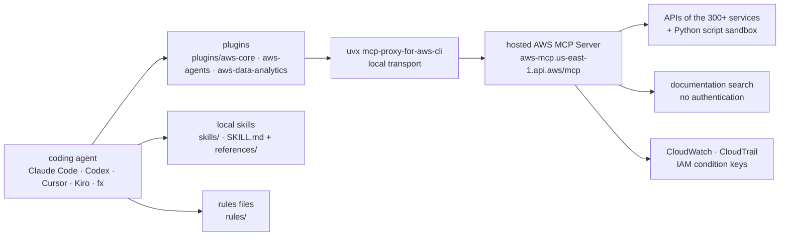

# aws/agent-toolkit-for-aws

> **Official AWS plugins, skills and MCP server so your coding agent can drive AWS.**

## The problem

A coding agent turned loose on AWS improvises: it guesses service names, invents API
parameters, produces approximate CloudFormation, and acts without anything in the logs telling
its calls apart from a human's. Every team then glues together its own instructions, its own
MCP configuration and its own IAM guardrails, with no end-to-end evaluation of what the agent
actually ends up doing.

## What it actually does

The repository gathers four pieces, shipped together or separately:

- **Plugins** (`plugins/`) bundle the AWS MCP Server configuration and a set of skills into one
  install: `aws-core` (service selection, CDK/CloudFormation, serverless, containers, storage,
  observability, billing, SDK usage, deployment — the README says to start here), `aws-agents`
  (agents on Bedrock and AgentCore), `aws-data-analytics` (S3 Tables, Glue, Athena) and
  `aws-agents-for-devsecops` (incident investigation, code review, UAT, vulnerability scanning
  and penetration tests via AWS DevOps Agent and AWS Security Agent).
- **Skills** (`skills/`) are directories holding a `SKILL.md` and sometimes a `references/`,
  loaded on demand when a task matches.
- **Rules files** (`rules/`) are project-level configurations telling the agent to go through
  the MCP server and search documentation before acting.
- **The AWS MCP Server** is *hosted by AWS* — not in this repository. The README credits it
  with coverage of the 300+ AWS services behind a single authenticated endpoint, sandboxed
  Python script execution, current documentation search without authentication, and enterprise
  controls: CloudWatch metrics, agent-specific IAM condition keys, CloudTrail audit logging.

The README presents itself as the successor to the MCP servers, skills and plugins released
under AWS Labs in 2025; those keep working, and the best of them are to migrate here.

## How it is wired

No code-derived diagram exists for this repository: this graph is reconstructed from the README
alone, from the paths it names and the MCP configuration it gives.



The README stresses one point: MCP server and skills are independent. Skills do not require the
server, and the server does not serve locally installed skills.

## Try it

The README's own commands, per agent. For Claude Code the plugins live on the
`claude-plugins-official` marketplace, added by default:

```
/plugin install aws-core@claude-plugins-official
```

On `Plugin not found` the README has you refresh the index: `/plugin marketplace update
claude-plugins-official`. From the AWS CLI: `aws configure agent-toolkit`. For Codex:
`codex plugin marketplace add aws/agent-toolkit-for-aws`. For other agents, the skills alone
install with `npx skills add aws/agent-toolkit-for-aws/skills` (add `-a fx` for fx). The MCP
configuration is given as ready-to-paste JSON for Kiro (`.kiro/settings/mcp.json`) and fx
(`~/.fx/mcp.json`), around `uvx mcp-proxy-for-aws-cli@latest`.

## Cost and traps

- **The core is not in the repository.** The MCP server is a managed AWS service queried at
  `https://aws-mcp.us-east-1.api.aws/mcp`: what you clone under Apache-2.0 is the skills, the
  rules and the plugin manifests, not the engine.
- **An AWS account is required** for API calls and script execution — but not for documentation
  search or skill discovery, the README notes. The cost of the AWS calls your agent triggers is
  on you and is not quantified.
- **`uv` required**: the README lists it as a prerequisite for the `uvx` path.
- **Everything is logged on the AWS side**: CloudWatch metrics and a CloudTrail entry *for
  every request*, presented as a control feature. It is also telemetry on your agent's activity,
  held by the provider.
- **Hard-coded regions** in the examples: `us-east-1` endpoint, `AWS_REGION=us-west-2`
  metadata. The README points to its documentation for supported Regions.
- **Uneven coverage**: plugins are announced only for Claude Code, Codex and Cursor. Elsewhere
  it is MCP server plus skills, by hand.

## What it is not

- **Not an agent.** Nothing here reasons: the repository equips an agent you already have.
  Without Claude Code, Codex, Cursor, Kiro or fx there is nothing to run.
- **Not a self-hostable MCP server.** The server is hosted by AWS; the repository ships only
  its client configuration. No offline start, no documented local variant.
- **Not a guardrail by itself.** IAM condition keys let you write policies that tell agent from
  human — you still have to write them. The README sells the capability, not a default policy.
- **Not the end of AWS Labs**: AWS Labs tools keep working and accepting contributions, which
  means two parallel ecosystems during the transition.

## Alternatives

| | When to prefer it |
|---|---|
| **awslabs** (named in the README) | The 2025 AWS Labs MCP servers, skills and plugins, which this repository declares itself the successor to. Keep it if a specialised MCP server already exists there and has not migrated yet. |
| **IBM/mcp-context-forge** | Worth a look when the need is not AWS but the gateway: federating and controlling several MCP servers yourself, rather than consuming one vendor's managed endpoint. |
| The catalogue's other neighbours (`langgenius/dify`, `yctimlin/mcp_excalidraw`, `zzet/gortex`) do not play this role: no comparable alternative in the catalogue. | |

## For you

Worth adopting if you touch AWS from a coding agent: it is the official source, the licence is
clean, and `/plugin install aws-core@claude-plugins-official` costs one command. The two
plugins to look at closely for your profile are `aws-agents` (Bedrock, AgentCore) and
`aws-data-analytics` (S3 Tables, Glue, Athena). It is also a case study to dissect: the
repository is a catalogue of `SKILL.md` files published by AWS — readable material to compare
against your own skills. Bear in mind that the engine itself is a logged third-party service.
