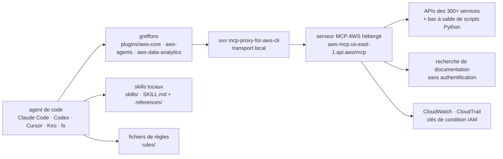

# aws/agent-toolkit-for-aws

> **Greffons, skills et serveur MCP officiels AWS pour que ton agent de code sache piloter AWS.**

## Le problème

Un agent de code lâché sur une infrastructure AWS improvise : il devine les noms de services,
invente des paramètres d'API, produit du CloudFormation approximatif et agit sans qu'on puisse
distinguer ses appels de ceux d'un humain dans les journaux. Chaque équipe recolle alors ses
propres consignes, sa propre configuration MCP et ses propres garde-fous IAM, sans évaluation
de bout en bout de ce que l'agent finit réellement par faire.

## Ce que ça fait vraiment

Le dépôt rassemble quatre briques, distribuées ensemble ou séparément :

- **Les greffons** (`plugins/`) empaquetent la configuration du serveur MCP AWS et un jeu de
  skills en une installation unique : `aws-core` (choix de service, CDK/CloudFormation,
  serverless, conteneurs, stockage, observabilité, facturation, usage des SDK, déploiement —
  le README dit de commencer par celui-ci), `aws-agents` (agents sur Bedrock et AgentCore),
  `aws-data-analytics` (S3 Tables, Glue, Athena) et `aws-agents-for-devsecops` (investigation
  d'incidents, revue de code, UAT, scan de vulnérabilités, tests d'intrusion via AWS DevOps
  Agent et AWS Security Agent).
- **Les skills** (`skills/`) sont des répertoires contenant un `SKILL.md` et parfois un
  `references/`, chargés à la demande quand la tâche correspond.
- **Les fichiers de règles** (`rules/`) sont des configurations au niveau projet qui disent à
  l'agent de passer par le serveur MCP et de chercher la documentation avant d'agir.
- **Le serveur MCP AWS** est *hébergé par AWS* — pas dans ce dépôt. Le README lui prête la
  couverture des 300+ services AWS via un point d'entrée authentifié, l'exécution de scripts
  Python en bac à sable, la recherche de documentation à jour sans authentification, et des
  contrôles d'entreprise : métriques CloudWatch, clés de condition IAM propres aux agents,
  journalisation CloudTrail.

Le README se présente comme le successeur des serveurs MCP, skills et greffons publiés sous
AWS Labs en 2025 ; ceux-ci continuent de fonctionner et le meilleur doit migrer ici.

## Comment c'est branché

Aucun diagramme tiré du code n'existe pour ce dépôt : ce schéma est reconstruit depuis le seul
README, à partir des chemins qu'il nomme et de la configuration MCP qu'il donne.



Le README insiste sur un point : serveur MCP et skills sont indépendants. Les skills ne
nécessitent pas le serveur, et le serveur ne sert pas les skills installés localement.

## Essayer

Les commandes du README, selon l'agent. Pour Claude Code, les greffons sont sur la place de
marché `claude-plugins-official`, ajoutée par défaut :

```
/plugin install aws-core@claude-plugins-official
```

Si `Plugin not found`, le README fait rafraîchir l'index : `/plugin marketplace update
claude-plugins-official`. Depuis le terminal AWS CLI : `aws configure agent-toolkit`. Pour
Codex : `codex plugin marketplace add aws/agent-toolkit-for-aws`. Pour les autres agents, les
skills seuls s'installent par `npx skills add aws/agent-toolkit-for-aws/skills` (ajouter
`-a fx` pour fx). La configuration MCP est donnée en JSON prêt à coller pour Kiro
(`.kiro/settings/mcp.json`) et fx (`~/.fx/mcp.json`), autour de
`uvx mcp-proxy-for-aws-cli@latest`.

## Coût et pièges

- **Le cœur n'est pas dans le dépôt.** Le serveur MCP est un service managé AWS interrogé sur
  `https://aws-mcp.us-east-1.api.aws/mcp` : le code que tu clones sous licence Apache-2.0 ce
  sont les skills, les règles et les manifestes de greffons, pas le moteur.
- **Compte AWS obligatoire** pour les appels d'API et l'exécution de scripts — mais pas pour la
  recherche de documentation ni la découverte de skills, précise le README. Le coût des appels
  AWS déclenchés par l'agent reste à ta charge et n'est pas chiffré.
- **`uv` requis** : le README le liste en prérequis pour la voie `uvx`.
- **Tout est journalisé côté AWS** : métriques CloudWatch et entrée CloudTrail *pour chaque
  requête*, présentés comme une fonctionnalité de contrôle. C'est aussi de la télémétrie sur
  l'activité de ton agent, chez le fournisseur.
- **Région en dur** dans les exemples : point d'entrée `us-east-1`, métadonnée
  `AWS_REGION=us-west-2`. Le README renvoie à sa documentation pour les régions prises en
  charge.
- **Couverture inégale** : les greffons ne sont annoncés que pour Claude Code, Codex et Cursor.
  Ailleurs, c'est serveur MCP + skills à la main.

## Ce que ce n'est pas

- **Ce n'est pas un agent.** Rien ici ne raisonne : le dépôt outille un agent que tu possèdes
  déjà. Sans Claude Code, Codex, Cursor, Kiro ou fx, il n'y a rien à lancer.
- **Ce n'est pas un serveur MCP à auto-héberger.** Le serveur est hébergé par AWS ; le dépôt
  n'en livre que la configuration client. Pas de démarrage hors ligne, pas de variante locale
  documentée.
- **Ce n'est pas un garde-fou en soi.** Les clés de condition IAM permettent d'écrire des
  politiques distinguant agent et humain — encore faut-il les écrire. Le README vend la
  capacité, pas une politique par défaut.
- **Ce n'est pas la fin d'AWS Labs** : les outils AWS Labs restent fonctionnels et ouverts aux
  contributions, ce qui veut dire deux écosystèmes en parallèle pendant la transition.

## Alternatives

| | Quand le préférer |
|---|---|
| **awslabs** (nommé dans le README) | Les serveurs MCP, skills et greffons AWS Labs de 2025, dont ce dépôt se déclare le successeur. À garder si un serveur MCP spécialisé y existe déjà et n'a pas encore migré. |
| **IBM/mcp-context-forge** | À regarder quand le besoin n'est pas AWS mais la passerelle : fédérer et contrôler plusieurs serveurs MCP soi-même, plutôt que de consommer un point d'entrée managé d'un seul fournisseur. |
| Les autres voisins du catalogue (`langgenius/dify`, `yctimlin/mcp_excalidraw`, `zzet/gortex`) ne jouent pas ce rôle : aucune autre alternative comparable dans le catalogue. | |

## Pour toi

À adopter si tu touches à AWS depuis un agent de code : c'est la source officielle, la licence
est propre, et `/plugin install aws-core@claude-plugins-official` coûte une commande. Les deux
greffons à regarder de près pour ton profil sont `aws-agents` (Bedrock, AgentCore) et
`aws-data-analytics` (S3 Tables, Glue, Athena). À l'inverse, c'est aussi un cas d'école à
disséquer : le dépôt est un catalogue de `SKILL.md` publié par AWS — de la matière directement
lisible pour comparer avec tes propres skills. Garde en tête que le moteur, lui, est un service
tiers journalisé.
