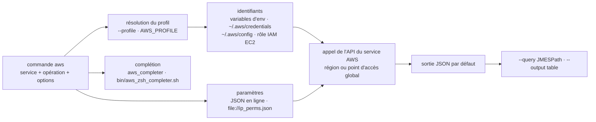

# aws/aws-cli

> **Amazon Web Services' official command line client, for driving AWS accounts from a terminal or a script.**

## The problem

Without it, every AWS service is reachable either through the web console — not scriptable,
not reproducible — or through an SDK, which means writing a program for the smallest
operation. On top of that sits the credentials question: access keys, temporary tokens, IAM
roles, several accounts, default regions, each with its own way of being supplied.

## What it actually does

The README states it in one line: "a unified command line interface to Amazon Web Services".
The `aws` command exposes AWS service APIs as subcommands (`aws iam list-users`,
`aws ec2 describe-instances`, `aws s3api list-objects`); the package is written in Python and
the README declares support for Python 3.9 through 3.14.

Around that call, the tool settles four concrete things. **Credentials**: environment
variables, the shared file `~/.aws/credentials`, the config file `~/.aws/config`, or an IAM
role picked up automatically on an EC2 instance; several `profiles` coexist and are selected
with `--profile`. **Input**: complex parameters are passed as JSON on the command line, or
read from a file through the `file://` prefix. **Output**: JSON by default, filterable with
`--query` in JMESPath, or an ASCII table with `--output table`. **Completion**:
`aws_completer` for bash, `bin/aws_zsh_completer.sh` for zsh, plus a `--cli-auto-prompt` mode
on v2.

A table in the README lists the other configurable variables in their three forms — option,
config entry, environment variable: `region`/`AWS_DEFAULT_REGION`,
`output`/`AWS_DEFAULT_OUTPUT`, `ca_bundle`, `metadata_service_timeout`,
`parameter_validation`, and so on. Services with a single global endpoint, such as IAM, are
reached without specifying a region.

## How it is wired



No code-derived diagram exists for this repository: the graph above is reconstructed from the
README alone, and therefore names only the files the README itself cites
(`~/.aws/credentials`, `~/.aws/config`, `bin/aws_zsh_completer.sh`,
`requirements-dev-lock.txt`).

## Trying it

The install path the README recommends for v2 is per-platform installers (macOS
`AWSCLIV2.pkg`, Linux x86-64 and arm64 archives, Windows MSI), not `pip`. Then:

```bash
$ aws configure
AWS Access Key ID: foo
AWS Secret Access Key: bar
Default region name [us-west-2]: us-west-2
Default output format [None]: json
```

Or through environment variables, followed by a first call:

```bash
$ export AWS_ACCESS_KEY_ID=<access_key>
$ export AWS_SECRET_ACCESS_KEY=<secret_key>
$ export AWS_DEFAULT_REGION=us-west-2

$ aws iam list-users --query Users[].UserName
$ aws s3api list-objects --bucket b --query Contents[].[Key,Size]
```

Turning on bash completion, and installing the development version from the repository:

```bash
$ complete -C aws_completer aws

$ cd <path_to_awscli> && git checkout v2
$ pip install -r requirements-dev-lock.txt
$ pip install -e .
$ aws --version
$ ./scripts/gen-ac-index --include-builtin-index
$ aws --cli-auto-prompt
```

## Cost and traps

- **An AWS account is the real prerequisite**, and with it an access key / secret key pair.
  The tool is free; everything it triggers is billed to the target account. A mistargeted
  command is spending, not just an error.
- **Credentials end up in cleartext** in `~/.aws/credentials` or in the environment — the
  README shows exactly that format. On EC2 it explicitly recommends IAM roles over keys left
  on the machine.
- **The default branch is not v2.** The README insists: `git checkout v2` is required, v2 is
  not the branch you get when cloning.
- **The profile prefix in the config file** is a classic mistake: section `[testing]` in
  `credentials` but `[profile testing]` in `config`, which the README puts in bold.
- **Licence**: the catalogue records `NOASSERTION` — GitHub could not identify the licence
  file, and the README says nothing about it. To be checked on the repository before any
  constrained use.
- **macOS 10.15 and earlier are no longer supported** as of 2024-11-13 for v2.
- The README points to the AWS security bulletins and asks that they be monitored regularly.

## What it is not

- **It is not an infrastructure-as-code tool.** Nothing in the README describes desired state,
  a plan or convergence: each command is an imperative API call, with no memory of what came
  before.
- **It is not an SDK to import.** It is an executable; for calling AWS from code, the README
  does not point at `awscli` but stays on command line usage.
- **It is not an abstraction layer over the services**: it exposes the APIs as they are, JSON
  shapes included. The README says so — "The AWS CLI implements AWS service APIs" — and for
  the limits of the services themselves it sends you elsewhere.
- **It is not independent of AWS**: without an account and credentials the command has nothing
  to do. The repository serves one provider only.

## Alternatives

The only neighbour the catalogue offers is **donnemartin/awesome-aws**, a list of AWS
resources and libraries: complementary, not comparable — it is an index, not a client. The
README itself names no competing tool; it mentions **jq** (`stedolan/jq`) as a companion for
processing JSON output when `--query` is not enough, and points to the *JMESPath Tutorial*
for the `--query` expression language. No comparable alternative in the catalogue.

## For you

Adopt without hesitation as soon as a data or MLOps project touches AWS: S3, SageMaker, ECR,
secrets and cluster authentication all go through `aws` before going through anything else,
and named profiles plus `--query` are enough to script most operational chores without
writing a line of Python. What needs care is not the tool but its wiring: named profiles, IAM
roles rather than keys on disk, an explicit region. Skip it if the infrastructure is not on
AWS.
