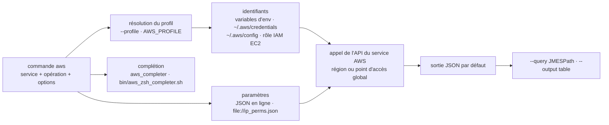

# aws/aws-cli

> **La ligne de commande officielle d'Amazon Web Services, pour piloter ses comptes AWS depuis un terminal ou un script.**

## Le problème

Sans elle, chaque service AWS s'atteint soit par la console web — non scriptable, non
reproductible — soit par un SDK, ce qui oblige à écrire un programme pour la moindre
opération. S'y ajoute la question des identifiants : clés d'accès, jetons temporaires,
rôles IAM, comptes multiples, régions par défaut, chacun avec sa propre façon d'être fourni.

## Ce que ça fait vraiment

Le README l'annonce en une ligne : « a unified command line interface to Amazon Web
Services ». La commande `aws` expose les API des services AWS comme des sous-commandes
(`aws iam list-users`, `aws ec2 describe-instances`, `aws s3api list-objects`) ; le paquet
est écrit en Python et le README déclare la prise en charge de Python 3.9 à 3.14.

Autour de cet appel, l'outil résout quatre choses concrètes. **Les identifiants** : variables
d'environnement, fichier partagé `~/.aws/credentials`, fichier de config `~/.aws/config`, ou
rôle IAM détecté automatiquement sur une instance EC2 ; plusieurs `profiles` coexistent et se
choisissent avec `--profile`. **L'entrée** : les paramètres complexes se passent en JSON sur
la ligne de commande, ou depuis un fichier via le préfixe `file://`. **La sortie** : JSON par
défaut, filtrable avec `--query` en JMESPath, ou table ASCII avec `--output table`. **La
complétion** : `aws_completer` pour bash, `bin/aws_zsh_completer.sh` pour zsh, plus un mode
`--cli-auto-prompt` côté v2.

Une table du README liste les autres variables configurables et leur triple forme — option,
entrée de config, variable d'environnement : `region`/`AWS_DEFAULT_REGION`,
`output`/`AWS_DEFAULT_OUTPUT`, `ca_bundle`, `metadata_service_timeout`,
`parameter_validation`, etc. Les services à point d'accès global comme IAM sont joints sans
qu'on ait à préciser de région.

## Comment c'est branché



Aucun diagramme tiré du code n'existe pour ce dépôt : ce schéma est reconstruit depuis le seul
README, et ne nomme donc que les fichiers que celui-ci cite (`~/.aws/credentials`,
`~/.aws/config`, `bin/aws_zsh_completer.sh`, `requirements-dev-lock.txt`).

## Essayer

L'installation recommandée par le README pour la v2 passe par des installeurs par plateforme
(paquet macOS `AWSCLIV2.pkg`, archives Linux x86-64 et arm64, MSI Windows), pas par `pip`.
Ensuite :

```bash
$ aws configure
AWS Access Key ID: foo
AWS Secret Access Key: bar
Default region name [us-west-2]: us-west-2
Default output format [None]: json
```

Ou par variables d'environnement, puis un premier appel :

```bash
$ export AWS_ACCESS_KEY_ID=<access_key>
$ export AWS_SECRET_ACCESS_KEY=<secret_key>
$ export AWS_DEFAULT_REGION=us-west-2

$ aws iam list-users --query Users[].UserName
$ aws s3api list-objects --bucket b --query Contents[].[Key,Size]
```

Activer la complétion bash, et installer la version de développement depuis le dépôt :

```bash
$ complete -C aws_completer aws

$ cd <path_to_awscli> && git checkout v2
$ pip install -r requirements-dev-lock.txt
$ pip install -e .
$ aws --version
$ ./scripts/gen-ac-index --include-builtin-index
$ aws --cli-auto-prompt
```

## Coût et pièges

- **Un compte AWS est le vrai prérequis**, et avec lui une paire clé d'accès / clé secrète.
  L'outil est gratuit ; tout ce qu'il déclenche est facturé sur le compte visé. Une commande
  mal ciblée est une dépense, pas seulement une erreur.
- **Les identifiants finissent en clair** dans `~/.aws/credentials` ou dans l'environnement —
  le README montre exactement ce format. Sur EC2, il recommande explicitement les rôles IAM
  plutôt que des clés posées sur la machine.
- **La branche par défaut n'est pas la v2.** Le README insiste : `git checkout v2` est
  nécessaire, la v2 n'est pas la branche clonée par défaut.
- **Le préfixe de profil dans le fichier de config** est une source d'erreur classique :
  section `[testing]` dans `credentials` mais `[profile testing]` dans `config`, le README le
  souligne en gras.
- **Licence** : le catalogue relève `NOASSERTION` — GitHub n'a pas su identifier le fichier
  de licence, et le README n'en dit rien. À lever sur le dépôt avant tout usage contraint.
- **macOS 10.15 et antérieurs ne sont plus pris en charge** depuis le 2024-11-13 pour la v2.
- Le README renvoie aux bulletins de sécurité AWS et demande de les surveiller régulièrement.

## Ce que ce n'est pas

- **Ce n'est pas un outil d'infrastructure-as-code.** Rien dans le README ne décrit d'état
  désiré, de plan ni de convergence : chaque commande est un appel d'API impératif, sans
  mémoire de ce qui a été fait avant.
- **Ce n'est pas un SDK à importer.** C'est un exécutable ; pour appeler AWS depuis du code,
  le README n'oriente pas vers `awscli` mais reste sur l'usage en ligne de commande.
- **Ce n'est pas une couche d'abstraction sur les services** : elle expose les API telles
  quelles, y compris leurs structures JSON. Le README le dit — « The AWS CLI implements AWS
  service APIs », et pour les limites des services eux-mêmes, il renvoie ailleurs.
- **Ce n'est pas indépendant d'AWS** : sans compte ni identifiants, la commande n'a rien à
  faire. Le dépôt ne sert qu'un fournisseur.

## Alternatives

Le seul voisin proposé par le catalogue est **donnemartin/awesome-aws**, une liste de
ressources et de bibliothèques AWS : complémentaire, pas comparable — c'est un index, pas un
client. Le README lui-même ne nomme aucun outil concurrent ; il mentionne **jq**
(`stedolan/jq`) comme complément pour traiter la sortie JSON quand `--query` ne suffit pas,
et renvoie au *JMESPath Tutorial* pour le langage d'expression de `--query`. Aucune
alternative comparable dans le catalogue.

## Pour toi

À adopter sans hésiter dès qu'un projet data ou MLOps touche à AWS : S3, SageMaker, ECR, les
secrets, l'authentification des clusters passent tous par `aws` avant de passer par quoi que
ce soit d'autre, et les profils multiples plus `--query` suffisent à scripter la plupart des
tâches d'exploitation sans écrire une ligne de Python. Le point à soigner n'est pas l'outil
mais son câblage : profils nommés, rôles IAM plutôt que clés posées sur disque, région
explicite. À ignorer si l'infrastructure n'est pas chez AWS.
