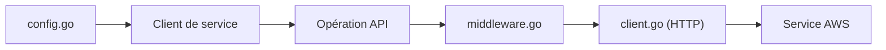

# aws/aws-sdk-go-v2

> SDK officiel AWS en Go : un client typé par service, avec pagination, waiters et signature.

## Le problème
Appeler les API AWS à la main impose signature, retries et sérialisation par service.

## Ce que ça fait vraiment
Charge la config (variables d'environnement, fichiers partagés), construit un client par service, appelle des opérations typées via une pile de middlewares (signature, retries, transport HTTP). Extensions : valeurs et expressions DynamoDB, signature CloudFront, jetons DSQL. Go 1.24 minimum.

## Comment c'est branché


## Essayer
```sh
go mod init helloaws
go get github.com/aws/aws-sdk-go-v2/aws
go get github.com/aws/aws-sdk-go-v2/config
go get github.com/aws/aws-sdk-go-v2/service/dynamodb
go run .
```

## Coût et pièges
Le SDK est gratuit ; les appels AWS sont facturés et exigent des identifiants.

## Ce que ce n'est pas
Pas multi-cloud. Le README ne donne pas de liste de services.

## Alternatives
La version précédente du SDK Go (guide de migration cité dans le README).

## Pour toi
Pertinent seulement si ton code Go parle à AWS ; en Python, boto3 est hors de ce dépôt : ignorer ici.

