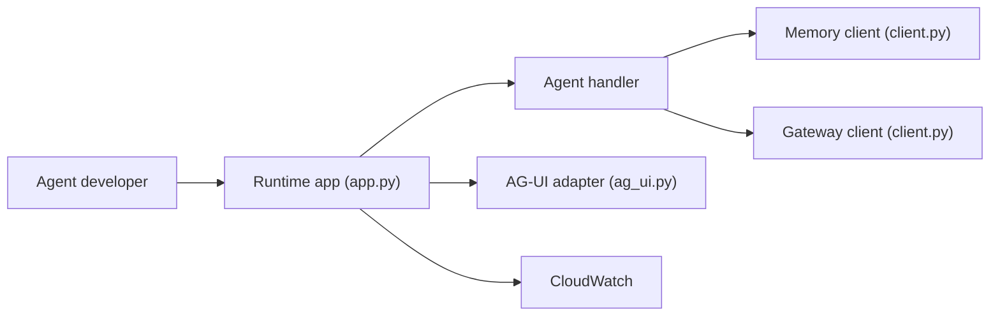

# aws/bedrock-agentcore-sdk-python

> SDK Python pour déployer un agent local sur Amazon Bedrock AgentCore et composer ses services.

## Le problème
Passer un agent du poste de dev à un hébergement sécurisé demande de gérer runtime, mémoire, authentification et traçage.

## Ce que ça fait vraiment
Fournit `BedrockAgentCoreApp` : on enregistre un handler avec `@app.entrypoint`, le runtime reçoit les invocations et streame la réponse. Des modules couvrent mémoire (sessions), gateway (API vers outils MCP), base de connaissances, navigateur, interpréteur de code, identité, politique, paiements, évaluation et traçage OpenTelemetry. Adaptateurs de protocole AG-UI et A2A. Fonctionne avec Strands, LangGraph, CrewAI, Autogen ou du code maison.

## Comment c'est branché


## Essayer
```bash
pip install "bedrock-agentcore[ag-ui]"
npm i -g @aws/agentcore
agentcore create --name MyAgent --defaults
cd MyAgent
agentcore deploy
```

## Coût et pièges
Les services AgentCore sont facturés par AWS ; il faut un compte AWS et des identifiants. Le CLI génère du CDK et provisionne l'infrastructure. 121 issues ouvertes.

## Ce que ce n'est pas
Ce n'est pas un framework d'agents : il n'apporte ni la logique ni les modèles, seulement l'hébergement et les services AWS. Le README vante la fiabilité et la sécurité sans preuve chiffrée.

## Alternatives
Aucune alternative nommée dans le README.

## Pour toi
À surveiller : pertinent si tu déploies déjà sur AWS et veux un runtime d'agents managé ; le verrouillage vers AgentCore est le prix à évaluer.

