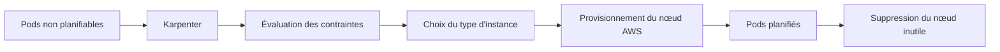

# aws/karpenter-provider-aws

> Provisionneur de nœuds Kubernetes qui crée et supprime des machines selon les pods en attente.

## Le problème
Les groupes d'autoscaling dimensionnent des pools figés : on paie des nœuds trop gros, ou les
pods restent en attente faute du bon type d'instance.

## Ce que ça fait vraiment
Quatre étapes, décrites telles quelles dans le README : surveiller les pods que l'ordonnanceur
Kubernetes a marqués non planifiables ; évaluer leurs contraintes de placement — demandes de
ressources, nodeSelectors, affinités, tolérances, contraintes de répartition topologique ;
provisionner des nœuds qui satisfont ces exigences ; les retirer quand ils ne servent plus.

## Comment c'est branché


## Essayer
```bash
# Aucune commande documentée dans le README : il renvoie aux « Docs » du projet
# et au canal #karpenter du Slack Kubernetes.
```

## Coût et pièges
Le projet est libre, mais les nœuds qu'il démarre sont facturés par AWS — c'est tout l'objet de
l'outil. Le README ne documente ni installation, ni configuration, ni permissions IAM requises :
tout est dans la documentation externe.

## Ce que ce n'est pas
Ce n'est pas un autoscaler de pods : il agit sur les nœuds, pas sur les réplicas. Ce n'est pas
multi-cloud — ce dépôt est le provider AWS. Le README est presque entièrement une liste de
conférences, sans matière technique exploitable.

## Alternatives
- **Kubernetes Cluster Autoscaler** : cité dans un titre de conférence comme point de comparaison.

## Pour toi
Sans objet pour un profil data ; c'est une affaire de plateforme Kubernetes sur AWS.
