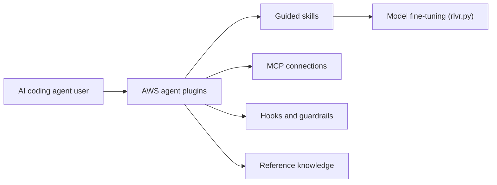

# awslabs/agent-plugins

> Plugins AWS (skills, serveurs MCP, hooks) pour Claude Code, Codex et Cursor.

## Le problème
Les agents de code connaissent mal les bonnes pratiques AWS, et coller de longs guides dans les prompts gonfle le contexte.

## Ce que ça fait vraiment
Dépôt de plugins packagés : skills (workflows guidés), serveurs MCP (documentation, tarification, IaC, Aurora DSQL), hooks (validation `sam validate`, vérification de schéma) et références. Plugins listés : Amazon Location Service, Amplify, serverless, transform, documentation de code, bases de données, déploiement, migration GCP vers AWS, SageMaker AI. Le README annonce que l'Agent Toolkit for AWS en est le successeur.

## Comment c'est branché


## Essayer
```bash
/plugin marketplace add awslabs/agent-plugins
/plugin install sagemaker-ai@agent-plugins-for-aws
/plugin install deploy-on-aws@agent-plugins-for-aws
```

## Coût et pièges
Plugins gratuits, mais les ressources AWS déployées sont à ta charge. Il faut un AWS CLI configuré et Claude Code ≥ 2.1.29 ou Cursor ≥ 2.5. Le README demande de relire le code généré et les coûts.

## Ce que ce n'est pas
Ce n'est pas un outil d'infrastructure : il guide un agent. Le README annonce que les projets les plus utiles migreront vers l'Agent Toolkit for AWS ; ce dépôt « continue de fonctionner ».

## Alternatives
Agent Toolkit for AWS : successeur annoncé dans le README (IAM condition keys, visibilité CloudWatch/CloudTrail).

## Pour toi
À surveiller : le plugin `sagemaker-ai` intéresse un profil MLOps sur AWS, mais comme le dépôt est appelé à migrer vers l'Agent Toolkit, regarde celui-ci avant de t'y investir.

