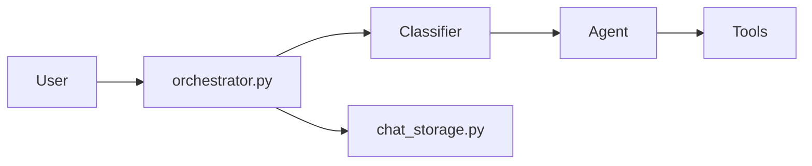

# awslabs/agent-squad

> Framework qui route chaque requête vers l'agent spécialisé adapté, en Python, TypeScript et Swift.

## Le problème
Avec plusieurs agents spécialisés, il faut décider lequel répond tout en gardant le contexte de la conversation.

## Ce que ça fait vraiment
Un classifieur choisit l'agent d'après les descriptions et l'historique ; l'agent répond (avec outils) ; l'orchestrateur enregistre l'échange. Agents prêts à l'emploi (Bedrock, Anthropic, OpenAI, Lex, Lambda), réponses en flux, SupervisorAgent (équipe d'agents en parallèle) et GroundedAgent (deux LLM pour limiter les hallucinations). Le runtime Swift fonctionne entièrement sur l'appareil (MCP, voix temps réel, traçage).

## Comment c'est branché


## Essayer
```bash
npm install agent-squad
pip install "agent-squad[aws]"
```

## Coût et pièges
Clés d'API du fournisseur de modèle (Bedrock, OpenAI, Anthropic…). Le projet a déménagé : le README annonce `2fastlabs/agent-squad` comme nouveau dépôt, et il s'appelait `multi-agent-orchestrator`.

## Ce que ce n'est pas
Ce n'est pas un modèle ni un agent unique : c'est une couche de routage. Ce dépôt n'est plus l'adresse officielle selon son README.

## Alternatives
Non documenté : le README ne nomme pas d'alternative.

## Pour toi
Surveiller : utile pour router plusieurs agents, mais le dépôt a migré ; suis le nouveau dépôt avant de t'y engager.

