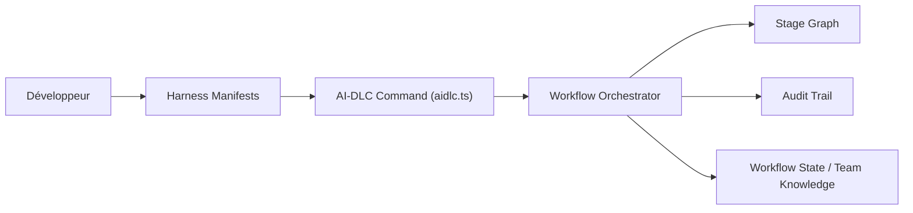

# awslabs/aidlc-workflows

> Cadre de workflows structurés avec validations humaines pour assistants de code, commun à sept environnements.

## Le problème
Le développement ad hoc avec un assistant IA perd le contexte quand le projet grossit, sans trace des décisions ni des validations.

## Ce que ça fait vraiment
Une commande `aidlc` installe un noyau neutre et des adaptateurs pour Claude Code, Kiro, Codex CLI, Cursor, opencode et Copilot. Depuis `/aidlc`, un orchestrateur choisit un profil de workflow, avance dans un graphe d'étapes (5 phases, 33 étapes), s'arrête aux points d'approbation et consigne un journal d'audit (102 événements), l'état et des règles apprises. Le câblage interne est en partie inféré.

## Comment c'est branché


## Essayer
```bash
curl -fsSL https://github.com/awslabs/aidlc-workflows/releases/latest/download/install.sh | sh
cd /path/to/your-project
aidlc config --harness claude
aidlc doctor
# puis, dans l'assistant : /aidlc Build a REST API for inventory management
```

## Coût et pièges
Gratuit ; le fournisseur de modèle dépend du harnais (Bedrock par défaut pour Claude Code et Codex). Le script d'installation est à exécuter via `curl | sh`. 222 issues ouvertes.

## Ce que ce n'est pas
Pas un modèle ni un assistant : une méthodologie et un moteur posés sur ton assistant. Le README rappelle que l'IA générative peut se tromper.

## Alternatives
Aucune alternative nommée dans le README.

## Pour toi
À surveiller : intéressant si ton équipe veut de la traçabilité et des points d'approbation autour d'assistants de code, mais le gain dépend d'une adoption disciplinée.
