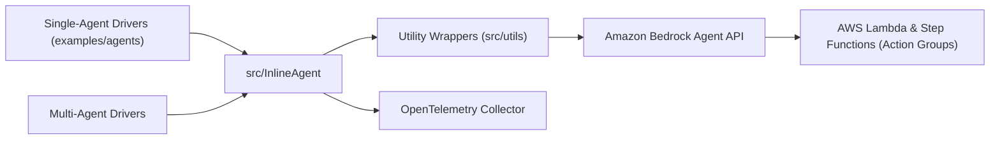

# awslabs/amazon-bedrock-agent-samples

> Exemples d'agents et de collaboration multi-agents sur Amazon Bedrock, pour développeurs AWS.

## Le problème
Utiliser Bedrock Agents (action groups, guardrails, mémoire, supervision multi-agents) sans exemples de départ est long.

## Ce que ça fait vraiment
Collection d'exemples (`examples/agents`, `examples/multi_agent_collaboration`, démos UX Streamlit) avec des modules partagés (`src/shared` : recherche web, mémoire de travail, données boursières) et des utilitaires boto3 (`src/utils`). D'après le code, une bibliothèque InlineAgent orchestre les appels à l'API Bedrock Agent, avec instrumentation OpenTelemetry.

## Comment c'est branché

## Essayer
Aucune commande dans le README : il demande d'ouvrir le README de chaque exemple sous `examples/*/*/`.

## Coût et pièges
Compte AWS et accès aux modèles Bedrock ; facturation à l'usage. Certains exemples utilisent Lambda, DynamoDB, ECS ou Amplify. Dernier push en avril 2026.

## Ce que ce n'est pas
Explicitement expérimental et éducatif : pas destiné à la production ; garde-fous (Guardrails) contre l'injection de prompt à mettre en place.

## Alternatives
- Amazon Bedrock Samples (dépôt cité) : exemples plus larges côté Bedrock.

## Pour toi
À ignorer sauf si ton entreprise est engagée sur Bedrock : exemples liés à AWS, sans portée générale pour la donnée ou le MLOps.
