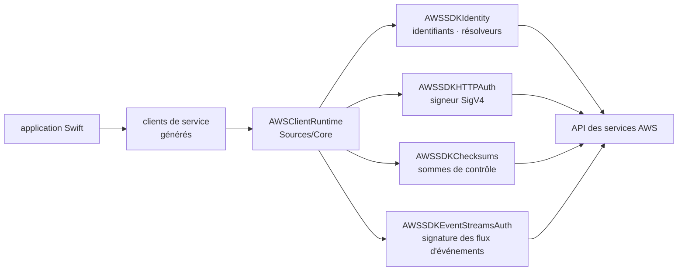

# awslabs/aws-sdk-swift

> **The official AWS SDK for Swift: calling Amazon services from Swift code.**

## The problem

Without a dedicated SDK, talking to AWS services from Swift means hand-rolling SigV4 request
signing, credential resolution, checksums and the event-stream format — cryptographic
plumbing nobody wants to write or maintain, and which fails silently when it is wrong.

## What it actually does

The repository ships the AWS SDK for Swift, maintained by AWS under the `awslabs` org. The
README does not describe the per-service clients: it points to the product page, the
developer guide, the API reference, and a separate examples repository
(`awsdocs/aws-doc-sdk-examples`, `swift` folder).

The only part it details is the runtime layer under `Sources/Core/`:

- `AWSClientRuntime` — the types, protocols and enums providing most AWS-specific runtime
  functionality; it depends on the other runtime modules.
- `AWSSDKHTTPAuth` — the SigV4 signer and the types involved in the auth flow.
- `AWSSDKIdentity` — AWS credentials and identity resolvers.
- `AWSSDKChecksums` — checksum handling in AWS requests.
- `AWSSDKEventStreamsAuth` — signing of AWS event-stream messages.
- `AWSSDKCommon` — concrete types shared by the other runtime modules.

In other words, the README documents the transport and authentication machinery, not the
application surface, which lives in the online documentation.

## How it is wired

No code-derived diagram exists for this repository: the graph below is reconstructed from the
README alone, from the runtime modules it lists under `Sources/Core/`.



`AWSSDKCommon` provides the types shared across those modules. A request therefore travels
through the service client, the common runtime layer, identity resolution and signing before
reaching the service API.

## Trying it

```bash
# No installation command is documented in the README.
# It points to "Set up the AWS SDK for Swift" and then the "Get started" tutorial
# in the online developer guide, plus the awsdocs/aws-doc-sdk-examples repository.
```

Nothing is reconstructed here: setup lives in the developer guide, not in the repository.

## Cost and traps

The library is Apache 2.0 licensed, so free. What costs money is what sits at the other end:
an AWS account and credentials are required, and every service call is billed per the target
service's pricing. Reading trap: the README documents neither supported Swift versions, nor
target platforms, nor the installation procedure — you must leave the repository to find out
whether you can use it. The examples live in another repository, adding a round trip.

## What it is not

It is not self-contained documentation: the README is a signpost page towards external
resources and teaches nothing about actual usage. It is not an application framework nor an
abstraction layer above AWS — the SDK exposes service APIs, it does not simplify their model.
And it is useless outside AWS: without an account and credentials, it does nothing.

## Alternatives

The README names no competing project, and no neighbours were supplied for this repository:
no comparable alternative in the catalogue. The only other repository cited,
`awsdocs/aws-doc-sdk-examples`, is not an alternative but the code-examples companion to the
same SDK.

## For you

Low interest for a data / AI / MLOps profile living in Python: this SDK only matters if you
write a Swift application — typically iOS or macOS — that must talk to S3, Bedrock or any
other AWS service. Worth remembering as the official entry point should that case arise, not
worth following otherwise.
